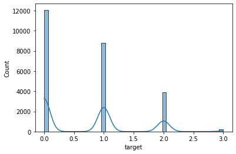
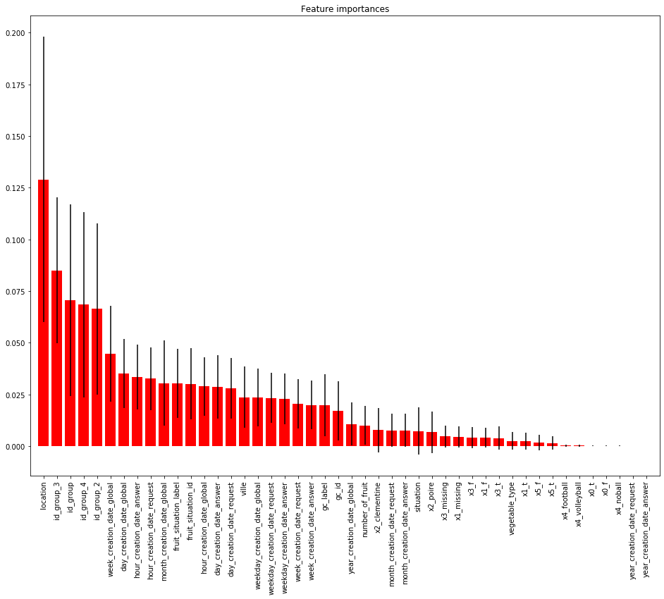

```python
%load_ext pycodestyle_magic
%flake8_on
```


```python
import pandas as pd
import numpy as np
import seaborn as sns

from sklearn.preprocessing import OneHotEncoder
from sklearn.preprocessing import LabelEncoder
from sklearn.metrics import log_loss
from sklearn.model_selection import train_test_split
from Target_encoder import target_encoding
import matplotlib.pyplot as plt
pd.set_option('display.max_columns', 100)
pd.set_option('display.width', 500)
np.random.seed(77)
```


```python

```

# Chargement données


```python
# chargement base de train
df_train = pd.read_csv(
    'train.csv', sep=',',
    low_memory=False,
    error_bad_lines=False)
df_train.drop("id", axis=1, inplace=True)
print(df_train.shape)

# chargement base de test
df_test = pd.read_csv(
    'test.csv', sep=',',
    low_memory=False,
    error_bad_lines=False)
print(df_test.shape)
```

    (25000, 23)
    (25000, 23)


# Description et analyse du dataset


```python
df_train.target.value_counts(dropna=False)
```


    0    12077
    1     8816
    2     3874
    3      233
    Name: target, dtype: int64


```python
df_train.target.value_counts(normalize=True, dropna=False)
```


    0    0.48308
    1    0.35264
    2    0.15496
    3    0.00932
    Name: target, dtype: float64


```python
sns.histplot(df_train, x="target", kde=True)
```


    <matplotlib.axes._subplots.AxesSubplot at 0x7fe29dc9ff90>





La variable cible contient 4 classes sur le jeu d'entrainement.
Les classes 2 et 3 sont sous representées.
classe 3 : 0.00932 => très rare
classe 2 : 0.15496
Les classes 1 et 2 representent plus du 3/4 du dataset de train.


```python
df_train.dtypes
```


    AP                       object
    creation_date_answer     object
    situation                 int64
    ctc                      object
    location                  int64
    gc_id                     int64
    gc_label                 object
    creation_date_global     object
    id_group                 object
    id_group_2               object
    favorite_fruit           object
    fruit_situation_id        int64
    fruit_situation_label    object
    fruits_or_vegetables     object
    number_of_fruit           int64
    id_group_3               object
    creation_date_request    object
    hobby                    object
    id_group_4               object
    ville                    object
    green_vegetables         object
    vegetable_type           object
    target                    int64
    dtype: object


Un jeu de données contenant majoritairement des données categorielles


```python
df_train.astype('object').describe().transpose()
```


<div>
<style scoped>
    .dataframe tbody tr th:only-of-type {
        vertical-align: middle;
    }

    .dataframe tbody tr th {
        vertical-align: top;
    }

    .dataframe thead th {
        text-align: right;
    }
</style>
<table border="1" class="dataframe">
  <thead>
    <tr style="text-align: right;">
      <th></th>
      <th>count</th>
      <th>unique</th>
      <th>top</th>
      <th>freq</th>
    </tr>
  </thead>
  <tbody>
    <tr>
      <th>AP</th>
      <td>25000</td>
      <td>2</td>
      <td>f</td>
      <td>24914</td>
    </tr>
    <tr>
      <th>creation_date_answer</th>
      <td>25000</td>
      <td>24278</td>
      <td>2019-02-06 09:00:00</td>
      <td>10</td>
    </tr>
    <tr>
      <th>situation</th>
      <td>25000</td>
      <td>8</td>
      <td>-1</td>
      <td>23965</td>
    </tr>
    <tr>
      <th>ctc</th>
      <td>9620</td>
      <td>2</td>
      <td>f</td>
      <td>8991</td>
    </tr>
    <tr>
      <th>location</th>
      <td>25000</td>
      <td>99</td>
      <td>70</td>
      <td>1245</td>
    </tr>
    <tr>
      <th>gc_id</th>
      <td>25000</td>
      <td>12</td>
      <td>10</td>
      <td>13813</td>
    </tr>
    <tr>
      <th>gc_label</th>
      <td>25000</td>
      <td>12</td>
      <td>A</td>
      <td>13813</td>
    </tr>
    <tr>
      <th>creation_date_global</th>
      <td>25000</td>
      <td>15680</td>
      <td>2018-04-25 13:46:28.524</td>
      <td>14</td>
    </tr>
    <tr>
      <th>id_group</th>
      <td>25000</td>
      <td>15844</td>
      <td>9eac919417ab0</td>
      <td>14</td>
    </tr>
    <tr>
      <th>id_group_2</th>
      <td>25000</td>
      <td>15675</td>
      <td>12c9978a3bdfb</td>
      <td>14</td>
    </tr>
    <tr>
      <th>favorite_fruit</th>
      <td>25000</td>
      <td>2</td>
      <td>clementine</td>
      <td>18147</td>
    </tr>
    <tr>
      <th>fruit_situation_id</th>
      <td>25000</td>
      <td>22</td>
      <td>200</td>
      <td>10651</td>
    </tr>
    <tr>
      <th>fruit_situation_label</th>
      <td>23272</td>
      <td>21</td>
      <td>ag</td>
      <td>10651</td>
    </tr>
    <tr>
      <th>fruits_or_vegetables</th>
      <td>7659</td>
      <td>2</td>
      <td>f</td>
      <td>6394</td>
    </tr>
    <tr>
      <th>number_of_fruit</th>
      <td>25000</td>
      <td>9</td>
      <td>-1</td>
      <td>17918</td>
    </tr>
    <tr>
      <th>id_group_3</th>
      <td>25000</td>
      <td>872</td>
      <td>fa2eb9a81317a</td>
      <td>298</td>
    </tr>
    <tr>
      <th>creation_date_request</th>
      <td>25000</td>
      <td>24280</td>
      <td>2019-02-06 09:00:00</td>
      <td>10</td>
    </tr>
    <tr>
      <th>hobby</th>
      <td>25000</td>
      <td>3</td>
      <td>football</td>
      <td>24661</td>
    </tr>
    <tr>
      <th>id_group_4</th>
      <td>25000</td>
      <td>15831</td>
      <td>d51245edaef2b</td>
      <td>20</td>
    </tr>
    <tr>
      <th>ville</th>
      <td>8088</td>
      <td>564</td>
      <td>Saint-Étienne</td>
      <td>475</td>
    </tr>
    <tr>
      <th>green_vegetables</th>
      <td>25000</td>
      <td>2</td>
      <td>f</td>
      <td>24564</td>
    </tr>
    <tr>
      <th>vegetable_type</th>
      <td>414</td>
      <td>6</td>
      <td>green</td>
      <td>227</td>
    </tr>
    <tr>
      <th>target</th>
      <td>25000</td>
      <td>4</td>
      <td>0</td>
      <td>12077</td>
    </tr>
  </tbody>
</table>
</div>


Possibilité de creer de nouvelles features à partir des variables qui peuvent etre transformées au format date.
exemple : creation_date_request / creation_date_global.

a voir si il y'a possibilité de creer des interactions entre les variables geographiques comme "ville" et "location". Location semble etre le departement, donc possiblité de recuperer une carto pour recuperer les regions de france.

```python
df_train.isnull().sum().sort_values(ascending = False)
```


    vegetable_type           24586
    fruits_or_vegetables     17341
    ville                    16912
    ctc                      15380
    fruit_situation_label     1728
    target                       0
    id_group                     0
    creation_date_answer         0
    situation                    0
    location                     0
    gc_id                        0
    gc_label                     0
    creation_date_global         0
    fruit_situation_id           0
    id_group_2                   0
    favorite_fruit               0
    number_of_fruit              0
    id_group_3                   0
    creation_date_request        0
    hobby                        0
    id_group_4                   0
    green_vegetables             0
    AP                           0
    dtype: int64


Les variables "vegetable_type", "fruits_or_vegetables", "ville", "ctc" sont tres peu renseignées. 
Pour les variables avec un taux de données manquantes des données manquantes raisonnable (inferieur à 30%), plusieurs moyen d'imputation de données sont possibles.
Imputation par la moyenne, par la mediane, extrapolation lineaire par d'autres variables correlees et ensuite utiliser l'equation de la droite pour l'imputation de données peut etre une technique d'imputation.
Des packages de sklearn "simple_imputer" ou autres existent aussi pour faciliter le traitement de données manquantes.

```python
var = 'vegetable_type'
df_train.groupby(var)['target'].agg(['mean', 'count', 'std'])
```


<div>
<style scoped>
    .dataframe tbody tr th:only-of-type {
        vertical-align: middle;
    }

    .dataframe tbody tr th {
        vertical-align: top;
    }

    .dataframe thead th {
        text-align: right;
    }
</style>
<table border="1" class="dataframe">
  <thead>
    <tr style="text-align: right;">
      <th></th>
      <th>mean</th>
      <th>count</th>
      <th>std</th>
    </tr>
    <tr>
      <th>vegetable_type</th>
      <th></th>
      <th></th>
      <th></th>
    </tr>
  </thead>
  <tbody>
    <tr>
      <th>almostgreen</th>
      <td>0.000000</td>
      <td>4</td>
      <td>0.000000</td>
    </tr>
    <tr>
      <th>green</th>
      <td>0.832599</td>
      <td>227</td>
      <td>0.925640</td>
    </tr>
    <tr>
      <th>notsogreen</th>
      <td>1.171429</td>
      <td>35</td>
      <td>0.785370</td>
    </tr>
    <tr>
      <th>prettygreen</th>
      <td>1.300000</td>
      <td>10</td>
      <td>1.059350</td>
    </tr>
    <tr>
      <th>salad</th>
      <td>1.007519</td>
      <td>133</td>
      <td>0.941439</td>
    </tr>
    <tr>
      <th>verygreen</th>
      <td>1.000000</td>
      <td>5</td>
      <td>1.000000</td>
    </tr>
  </tbody>
</table>
</div>


```python
df_train.vegetable_type.value_counts(normalize=True, dropna=False)
```


    NaN            0.98344
    green          0.00908
    salad          0.00532
    notsogreen     0.00140
    prettygreen    0.00040
    verygreen      0.00020
    almostgreen    0.00016
    Name: vegetable_type, dtype: float64


Nous pouvons nous poser la question de supprimer la variable vegetable_type qui est extrement mal renseigné et qui de premier abord ne pourra pas apporter de signal pour le modele.
Cependant, je vais decider de la conserver car l'objectif est de classifier des données désequilibrer et nous avons pu voir que les classes 3 et 4 sont très rares. Le modele pourrait tirer un peu d'information des quelques valeurs renseignés de cette variable qui pourrait etre utilise à la prediction des classes 3 et 4.

```python
df_train.groupby('target').agg({'vegetable_type': 'value_counts'})
```


<div>
<style scoped>
    .dataframe tbody tr th:only-of-type {
        vertical-align: middle;
    }

    .dataframe tbody tr th {
        vertical-align: top;
    }

    .dataframe thead th {
        text-align: right;
    }
</style>
<table border="1" class="dataframe">
  <thead>
    <tr style="text-align: right;">
      <th></th>
      <th></th>
      <th>vegetable_type</th>
    </tr>
    <tr>
      <th>target</th>
      <th>vegetable_type</th>
      <th></th>
    </tr>
  </thead>
  <tbody>
    <tr>
      <th rowspan="6" valign="top">0</th>
      <th>green</th>
      <td>113</td>
    </tr>
    <tr>
      <th>salad</th>
      <td>53</td>
    </tr>
    <tr>
      <th>notsogreen</th>
      <td>7</td>
    </tr>
    <tr>
      <th>almostgreen</th>
      <td>4</td>
    </tr>
    <tr>
      <th>prettygreen</th>
      <td>3</td>
    </tr>
    <tr>
      <th>verygreen</th>
      <td>2</td>
    </tr>
    <tr>
      <th rowspan="5" valign="top">1</th>
      <th>green</th>
      <td>45</td>
    </tr>
    <tr>
      <th>salad</th>
      <td>31</td>
    </tr>
    <tr>
      <th>notsogreen</th>
      <td>16</td>
    </tr>
    <tr>
      <th>prettygreen</th>
      <td>2</td>
    </tr>
    <tr>
      <th>verygreen</th>
      <td>1</td>
    </tr>
    <tr>
      <th rowspan="5" valign="top">2</th>
      <th>green</th>
      <td>63</td>
    </tr>
    <tr>
      <th>salad</th>
      <td>44</td>
    </tr>
    <tr>
      <th>notsogreen</th>
      <td>11</td>
    </tr>
    <tr>
      <th>prettygreen</th>
      <td>4</td>
    </tr>
    <tr>
      <th>verygreen</th>
      <td>2</td>
    </tr>
    <tr>
      <th rowspan="4" valign="top">3</th>
      <th>green</th>
      <td>6</td>
    </tr>
    <tr>
      <th>salad</th>
      <td>5</td>
    </tr>
    <tr>
      <th>notsogreen</th>
      <td>1</td>
    </tr>
    <tr>
      <th>prettygreen</th>
      <td>1</td>
    </tr>
  </tbody>
</table>
</div>


# Nettoyage des données et création des features

## Gestion des  dates


```python
# fonction pour parser une date
def parsing_date(df, column):
    df[f'day_{column}'] = df[column].dt.day
    df[f'week_{column}'] = df[column].dt.week
    df[f'month_{column}'] = df[column].dt.month
    df[f'year_{column}'] = df[column].dt.year
    df[f'hour_{column}'] = df[column].dt.hour
    df[f'weekday_{column}'] = df[column].dt.weekday
    return df

date_columns = [col for col in df_train.columns if "date" in col]

# fonction pour appliquer les transformations sur base de train et de test
def create_date_columns(df, columns):
    for date_col in columns:
        df[date_col] = pd.to_datetime(df[date_col])
        df = parsing_date(df, date_col)
        df.drop(date_col, axis=1, inplace=True)
    return df

df_test= create_date_columns(df_test, date_columns)
df_train= create_date_columns(df_train, date_columns)                    
```

    11:1: E305 expected 2 blank lines after class or function definition, found 1
    14:1: E302 expected 2 blank lines, found 1
    21:1: E305 expected 2 blank lines after class or function definition, found 1
    21:8: E225 missing whitespace around operator
    22:9: E225 missing whitespace around operator


## Gestion des données catégorielles


```python
# Identification des variables de type objet.
var_to_encode = df_train.select_dtypes(include=object).columns
```


```python
var_to_encode
```


    Index(['AP', 'ctc', 'gc_label', 'id_group', 'id_group_2', 'favorite_fruit', 'fruit_situation_label', 'fruits_or_vegetables', 'id_group_3', 'hobby', 'id_group_4', 'ville', 'green_vegetables', 'vegetable_type'], dtype='object')


```python
df_train[var_to_encode].describe().T
```


<div>
<style scoped>
    .dataframe tbody tr th:only-of-type {
        vertical-align: middle;
    }

    .dataframe tbody tr th {
        vertical-align: top;
    }

    .dataframe thead th {
        text-align: right;
    }
</style>
<table border="1" class="dataframe">
  <thead>
    <tr style="text-align: right;">
      <th></th>
      <th>count</th>
      <th>unique</th>
      <th>top</th>
      <th>freq</th>
    </tr>
  </thead>
  <tbody>
    <tr>
      <th>AP</th>
      <td>25000</td>
      <td>2</td>
      <td>f</td>
      <td>24914</td>
    </tr>
    <tr>
      <th>ctc</th>
      <td>9620</td>
      <td>2</td>
      <td>f</td>
      <td>8991</td>
    </tr>
    <tr>
      <th>gc_label</th>
      <td>25000</td>
      <td>12</td>
      <td>A</td>
      <td>13813</td>
    </tr>
    <tr>
      <th>id_group</th>
      <td>25000</td>
      <td>15844</td>
      <td>9eac919417ab0</td>
      <td>14</td>
    </tr>
    <tr>
      <th>id_group_2</th>
      <td>25000</td>
      <td>15675</td>
      <td>12c9978a3bdfb</td>
      <td>14</td>
    </tr>
    <tr>
      <th>favorite_fruit</th>
      <td>25000</td>
      <td>2</td>
      <td>clementine</td>
      <td>18147</td>
    </tr>
    <tr>
      <th>fruit_situation_label</th>
      <td>23272</td>
      <td>21</td>
      <td>ag</td>
      <td>10651</td>
    </tr>
    <tr>
      <th>fruits_or_vegetables</th>
      <td>7659</td>
      <td>2</td>
      <td>f</td>
      <td>6394</td>
    </tr>
    <tr>
      <th>id_group_3</th>
      <td>25000</td>
      <td>872</td>
      <td>fa2eb9a81317a</td>
      <td>298</td>
    </tr>
    <tr>
      <th>hobby</th>
      <td>25000</td>
      <td>3</td>
      <td>football</td>
      <td>24661</td>
    </tr>
    <tr>
      <th>id_group_4</th>
      <td>25000</td>
      <td>15831</td>
      <td>d51245edaef2b</td>
      <td>20</td>
    </tr>
    <tr>
      <th>ville</th>
      <td>8088</td>
      <td>564</td>
      <td>Saint-Étienne</td>
      <td>475</td>
    </tr>
    <tr>
      <th>green_vegetables</th>
      <td>25000</td>
      <td>2</td>
      <td>f</td>
      <td>24564</td>
    </tr>
    <tr>
      <th>vegetable_type</th>
      <td>414</td>
      <td>6</td>
      <td>green</td>
      <td>227</td>
    </tr>
  </tbody>
</table>
</div>


#  Encoding
Application du target encoding sur les données categorielles
autres solution possible label encoding ou one hot encoding
avantage du target encoding : eviter l'ordinalite que pourrait apporter un encodage du type label encoding

Choix d'utiliser le target encoding pour les variables contenant plus de 3 modalités.
Pour variables avec 3 ou 2 modalités, un one hot encoding sera appliqué.

```python
var_to_encode_describe = df_train[var_to_encode].describe().T
```


```python
# Recuperer dans une variable les noms de variables
# pour lesquelles un one hot encoding sera appliqué
var_to_one_hot = var_to_encode_describe[var_to_encode_describe.unique <= 3].index
```


```python
# Gestion des données manquantes avec un fillna par la modalité missing.
# Le ohe creera une colonne specifique pour les données manquantes.
# Un modele peut extraire de l'information sur des données non renseignés.

df_train[var_to_one_hot] = df_train[var_to_one_hot].fillna("missing")
df_test[var_to_one_hot] = df_test[var_to_one_hot].fillna("missing")
```


```python
# application du ohe
drop_enc = OneHotEncoder().fit(df_train[var_to_one_hot])

df_train_ohe = drop_enc.transform(df_train[var_to_one_hot])
df_test_ohe = drop_enc.transform(df_test[var_to_one_hot])
```


```python
# transformation de la matrice en format dataframe
# concatenation des colonnes encodées
# suppression des variables originales

df_train.drop(var_to_one_hot, axis=1, inplace=True)

df_train_ohe = pd.concat([pd.DataFrame.sparse.from_spmatrix
                          (df_train_ohe,
                           columns=drop_enc.get_feature_names()),
                           df_train],
                        axis=1)

df_test.drop(var_to_one_hot, axis=1, inplace=True)

df_test_ohe = pd.concat([pd.DataFrame.sparse.from_spmatrix
                         (df_test_ohe, 
                        columns=drop_enc.get_feature_names()),
                        df_test], axis=1)


```

    /opt/anaconda3/lib/python3.7/site-packages/sklearn/utils/deprecation.py:87: FutureWarning: Function get_feature_names is deprecated; get_feature_names is deprecated in 1.0 and will be removed in 1.2. Please use get_feature_names_out instead.
      warnings.warn(msg, category=FutureWarning)
    10:28: E127 continuation line over-indented for visual indent
    11:25: E128 continuation line under-indented for visual indent
    16:39: W291 trailing whitespace
    17:25: E128 continuation line under-indented for visual indent


```python
df_train_ohe
```


<div>
<style scoped>
    .dataframe tbody tr th:only-of-type {
        vertical-align: middle;
    }

    .dataframe tbody tr th {
        vertical-align: top;
    }

    .dataframe thead th {
        text-align: right;
    }
</style>
<table border="1" class="dataframe">
  <thead>
    <tr style="text-align: right;">
      <th></th>
      <th>x0_f</th>
      <th>x0_t</th>
      <th>x1_f</th>
      <th>x1_missing</th>
      <th>x1_t</th>
      <th>x2_clementine</th>
      <th>x2_poire</th>
      <th>x3_f</th>
      <th>x3_missing</th>
      <th>x3_t</th>
      <th>x4_football</th>
      <th>x4_noball</th>
      <th>x4_volleyball</th>
      <th>x5_f</th>
      <th>x5_t</th>
      <th>situation</th>
      <th>location</th>
      <th>gc_id</th>
      <th>gc_label</th>
      <th>id_group</th>
      <th>id_group_2</th>
      <th>fruit_situation_id</th>
      <th>fruit_situation_label</th>
      <th>number_of_fruit</th>
      <th>id_group_3</th>
      <th>id_group_4</th>
      <th>ville</th>
      <th>vegetable_type</th>
      <th>target</th>
      <th>day_creation_date_answer</th>
      <th>week_creation_date_answer</th>
      <th>month_creation_date_answer</th>
      <th>year_creation_date_answer</th>
      <th>hour_creation_date_answer</th>
      <th>weekday_creation_date_answer</th>
      <th>day_creation_date_global</th>
      <th>week_creation_date_global</th>
      <th>month_creation_date_global</th>
      <th>year_creation_date_global</th>
      <th>hour_creation_date_global</th>
      <th>weekday_creation_date_global</th>
      <th>day_creation_date_request</th>
      <th>week_creation_date_request</th>
      <th>month_creation_date_request</th>
      <th>year_creation_date_request</th>
      <th>hour_creation_date_request</th>
      <th>weekday_creation_date_request</th>
    </tr>
  </thead>
  <tbody>
    <tr>
      <th>0</th>
      <td>1.0</td>
      <td>0.0</td>
      <td>0.0</td>
      <td>1.0</td>
      <td>0.0</td>
      <td>0.0</td>
      <td>1.0</td>
      <td>0.0</td>
      <td>1.0</td>
      <td>0.0</td>
      <td>1.0</td>
      <td>0.0</td>
      <td>0.0</td>
      <td>1.0</td>
      <td>0.0</td>
      <td>-1</td>
      <td>52</td>
      <td>70</td>
      <td>G</td>
      <td>2d7e206d46ea1</td>
      <td>36bac09400660</td>
      <td>120</td>
      <td>jzy</td>
      <td>-1</td>
      <td>812a43d710ace</td>
      <td>aa8f4934a31eb</td>
      <td>NaN</td>
      <td>NaN</td>
      <td>0</td>
      <td>13</td>
      <td>11</td>
      <td>3</td>
      <td>2019</td>
      <td>11</td>
      <td>2</td>
      <td>17</td>
      <td>3</td>
      <td>1</td>
      <td>2019</td>
      <td>10</td>
      <td>3</td>
      <td>13</td>
      <td>11</td>
      <td>3</td>
      <td>2019</td>
      <td>11</td>
      <td>2</td>
    </tr>
    <tr>
      <th>1</th>
      <td>1.0</td>
      <td>0.0</td>
      <td>0.0</td>
      <td>1.0</td>
      <td>0.0</td>
      <td>1.0</td>
      <td>0.0</td>
      <td>0.0</td>
      <td>1.0</td>
      <td>0.0</td>
      <td>1.0</td>
      <td>0.0</td>
      <td>0.0</td>
      <td>1.0</td>
      <td>0.0</td>
      <td>-1</td>
      <td>78</td>
      <td>10</td>
      <td>A</td>
      <td>35e96d6848871</td>
      <td>80a697d593706</td>
      <td>10</td>
      <td>ae</td>
      <td>-1</td>
      <td>4b59257f24573</td>
      <td>6ff9ea9ec85fd</td>
      <td>NaN</td>
      <td>NaN</td>
      <td>1</td>
      <td>21</td>
      <td>12</td>
      <td>3</td>
      <td>2019</td>
      <td>14</td>
      <td>3</td>
      <td>20</td>
      <td>34</td>
      <td>8</td>
      <td>2018</td>
      <td>5</td>
      <td>0</td>
      <td>21</td>
      <td>12</td>
      <td>3</td>
      <td>2019</td>
      <td>14</td>
      <td>3</td>
    </tr>
    <tr>
      <th>2</th>
      <td>1.0</td>
      <td>0.0</td>
      <td>0.0</td>
      <td>1.0</td>
      <td>0.0</td>
      <td>1.0</td>
      <td>0.0</td>
      <td>0.0</td>
      <td>1.0</td>
      <td>0.0</td>
      <td>1.0</td>
      <td>0.0</td>
      <td>0.0</td>
      <td>1.0</td>
      <td>0.0</td>
      <td>-1</td>
      <td>70</td>
      <td>10</td>
      <td>A</td>
      <td>ffaf8085e383d</td>
      <td>c309176b96268</td>
      <td>200</td>
      <td>ag</td>
      <td>-1</td>
      <td>f1a838f0d194b</td>
      <td>6a49a0a97b049</td>
      <td>NaN</td>
      <td>NaN</td>
      <td>0</td>
      <td>15</td>
      <td>11</td>
      <td>3</td>
      <td>2019</td>
      <td>17</td>
      <td>4</td>
      <td>20</td>
      <td>51</td>
      <td>12</td>
      <td>2018</td>
      <td>13</td>
      <td>3</td>
      <td>15</td>
      <td>11</td>
      <td>3</td>
      <td>2019</td>
      <td>17</td>
      <td>4</td>
    </tr>
    <tr>
      <th>3</th>
      <td>1.0</td>
      <td>0.0</td>
      <td>1.0</td>
      <td>0.0</td>
      <td>0.0</td>
      <td>1.0</td>
      <td>0.0</td>
      <td>0.0</td>
      <td>1.0</td>
      <td>0.0</td>
      <td>1.0</td>
      <td>0.0</td>
      <td>0.0</td>
      <td>1.0</td>
      <td>0.0</td>
      <td>-1</td>
      <td>84</td>
      <td>10</td>
      <td>A</td>
      <td>5360cf0a40ce3</td>
      <td>13c1a3597648b</td>
      <td>10</td>
      <td>ae</td>
      <td>0</td>
      <td>c3196847d1c14</td>
      <td>d0dcf1ca1bf04</td>
      <td>NaN</td>
      <td>NaN</td>
      <td>1</td>
      <td>7</td>
      <td>2</td>
      <td>1</td>
      <td>2019</td>
      <td>8</td>
      <td>0</td>
      <td>21</td>
      <td>29</td>
      <td>7</td>
      <td>2018</td>
      <td>10</td>
      <td>5</td>
      <td>7</td>
      <td>2</td>
      <td>1</td>
      <td>2019</td>
      <td>8</td>
      <td>0</td>
    </tr>
    <tr>
      <th>4</th>
      <td>1.0</td>
      <td>0.0</td>
      <td>0.0</td>
      <td>1.0</td>
      <td>0.0</td>
      <td>1.0</td>
      <td>0.0</td>
      <td>0.0</td>
      <td>1.0</td>
      <td>0.0</td>
      <td>1.0</td>
      <td>0.0</td>
      <td>0.0</td>
      <td>1.0</td>
      <td>0.0</td>
      <td>-1</td>
      <td>29</td>
      <td>20</td>
      <td>D</td>
      <td>126c3211f23fc</td>
      <td>7b68e0a456571</td>
      <td>10</td>
      <td>ae</td>
      <td>-1</td>
      <td>70e18c6fe58cd</td>
      <td>b4870b1c8eb42</td>
      <td>NaN</td>
      <td>NaN</td>
      <td>1</td>
      <td>3</td>
      <td>5</td>
      <td>2</td>
      <td>2019</td>
      <td>17</td>
      <td>6</td>
      <td>7</td>
      <td>49</td>
      <td>12</td>
      <td>2018</td>
      <td>19</td>
      <td>4</td>
      <td>3</td>
      <td>5</td>
      <td>2</td>
      <td>2019</td>
      <td>17</td>
      <td>6</td>
    </tr>
    <tr>
      <th>...</th>
      <td>...</td>
      <td>...</td>
      <td>...</td>
      <td>...</td>
      <td>...</td>
      <td>...</td>
      <td>...</td>
      <td>...</td>
      <td>...</td>
      <td>...</td>
      <td>...</td>
      <td>...</td>
      <td>...</td>
      <td>...</td>
      <td>...</td>
      <td>...</td>
      <td>...</td>
      <td>...</td>
      <td>...</td>
      <td>...</td>
      <td>...</td>
      <td>...</td>
      <td>...</td>
      <td>...</td>
      <td>...</td>
      <td>...</td>
      <td>...</td>
      <td>...</td>
      <td>...</td>
      <td>...</td>
      <td>...</td>
      <td>...</td>
      <td>...</td>
      <td>...</td>
      <td>...</td>
      <td>...</td>
      <td>...</td>
      <td>...</td>
      <td>...</td>
      <td>...</td>
      <td>...</td>
      <td>...</td>
      <td>...</td>
      <td>...</td>
      <td>...</td>
      <td>...</td>
      <td>...</td>
    </tr>
    <tr>
      <th>24995</th>
      <td>1.0</td>
      <td>0.0</td>
      <td>0.0</td>
      <td>1.0</td>
      <td>0.0</td>
      <td>1.0</td>
      <td>0.0</td>
      <td>0.0</td>
      <td>1.0</td>
      <td>0.0</td>
      <td>1.0</td>
      <td>0.0</td>
      <td>0.0</td>
      <td>1.0</td>
      <td>0.0</td>
      <td>-1</td>
      <td>17</td>
      <td>10</td>
      <td>A</td>
      <td>07d568301bae5</td>
      <td>8ed90715244e0</td>
      <td>160</td>
      <td>zht</td>
      <td>-1</td>
      <td>7f9b9fe72ad1b</td>
      <td>97de0f5d0b0cf</td>
      <td>NaN</td>
      <td>NaN</td>
      <td>0</td>
      <td>21</td>
      <td>12</td>
      <td>3</td>
      <td>2019</td>
      <td>16</td>
      <td>3</td>
      <td>16</td>
      <td>11</td>
      <td>3</td>
      <td>2019</td>
      <td>10</td>
      <td>5</td>
      <td>21</td>
      <td>12</td>
      <td>3</td>
      <td>2019</td>
      <td>16</td>
      <td>3</td>
    </tr>
    <tr>
      <th>24996</th>
      <td>1.0</td>
      <td>0.0</td>
      <td>0.0</td>
      <td>1.0</td>
      <td>0.0</td>
      <td>1.0</td>
      <td>0.0</td>
      <td>0.0</td>
      <td>1.0</td>
      <td>0.0</td>
      <td>1.0</td>
      <td>0.0</td>
      <td>0.0</td>
      <td>1.0</td>
      <td>0.0</td>
      <td>-1</td>
      <td>93</td>
      <td>10</td>
      <td>A</td>
      <td>ecf26c2e00203</td>
      <td>5f820a5b9c8cd</td>
      <td>10</td>
      <td>ae</td>
      <td>-1</td>
      <td>5918a05e76cfe</td>
      <td>0aac6e868db10</td>
      <td>NaN</td>
      <td>NaN</td>
      <td>1</td>
      <td>15</td>
      <td>7</td>
      <td>2</td>
      <td>2019</td>
      <td>21</td>
      <td>4</td>
      <td>15</td>
      <td>37</td>
      <td>9</td>
      <td>2018</td>
      <td>9</td>
      <td>5</td>
      <td>15</td>
      <td>7</td>
      <td>2</td>
      <td>2019</td>
      <td>21</td>
      <td>4</td>
    </tr>
    <tr>
      <th>24997</th>
      <td>1.0</td>
      <td>0.0</td>
      <td>1.0</td>
      <td>0.0</td>
      <td>0.0</td>
      <td>1.0</td>
      <td>0.0</td>
      <td>0.0</td>
      <td>1.0</td>
      <td>0.0</td>
      <td>1.0</td>
      <td>0.0</td>
      <td>0.0</td>
      <td>1.0</td>
      <td>0.0</td>
      <td>-1</td>
      <td>68</td>
      <td>10</td>
      <td>A</td>
      <td>c84066a550a3a</td>
      <td>6532597956225</td>
      <td>200</td>
      <td>ag</td>
      <td>0</td>
      <td>50101f6881261</td>
      <td>89c8a90e0ce38</td>
      <td>NaN</td>
      <td>NaN</td>
      <td>0</td>
      <td>3</td>
      <td>1</td>
      <td>1</td>
      <td>2019</td>
      <td>10</td>
      <td>3</td>
      <td>20</td>
      <td>38</td>
      <td>9</td>
      <td>2018</td>
      <td>13</td>
      <td>3</td>
      <td>3</td>
      <td>1</td>
      <td>1</td>
      <td>2019</td>
      <td>10</td>
      <td>3</td>
    </tr>
    <tr>
      <th>24998</th>
      <td>1.0</td>
      <td>0.0</td>
      <td>1.0</td>
      <td>0.0</td>
      <td>0.0</td>
      <td>1.0</td>
      <td>0.0</td>
      <td>0.0</td>
      <td>0.0</td>
      <td>1.0</td>
      <td>1.0</td>
      <td>0.0</td>
      <td>0.0</td>
      <td>1.0</td>
      <td>0.0</td>
      <td>-1</td>
      <td>78</td>
      <td>20</td>
      <td>D</td>
      <td>98e8126974bad</td>
      <td>8aa3d8d3a97d3</td>
      <td>200</td>
      <td>ag</td>
      <td>0</td>
      <td>0f1a3e137c5ea</td>
      <td>0157899906f02</td>
      <td>Moissy-Cramayel</td>
      <td>NaN</td>
      <td>1</td>
      <td>17</td>
      <td>3</td>
      <td>1</td>
      <td>2019</td>
      <td>12</td>
      <td>3</td>
      <td>4</td>
      <td>44</td>
      <td>11</td>
      <td>2018</td>
      <td>17</td>
      <td>6</td>
      <td>17</td>
      <td>3</td>
      <td>1</td>
      <td>2019</td>
      <td>12</td>
      <td>3</td>
    </tr>
    <tr>
      <th>24999</th>
      <td>1.0</td>
      <td>0.0</td>
      <td>0.0</td>
      <td>1.0</td>
      <td>0.0</td>
      <td>1.0</td>
      <td>0.0</td>
      <td>0.0</td>
      <td>1.0</td>
      <td>0.0</td>
      <td>1.0</td>
      <td>0.0</td>
      <td>0.0</td>
      <td>1.0</td>
      <td>0.0</td>
      <td>-1</td>
      <td>60</td>
      <td>10</td>
      <td>A</td>
      <td>1707d41f20deb</td>
      <td>8cd910513240b</td>
      <td>200</td>
      <td>ag</td>
      <td>0</td>
      <td>7232a3a11e532</td>
      <td>fbb2e051ded47</td>
      <td>NaN</td>
      <td>NaN</td>
      <td>0</td>
      <td>26</td>
      <td>9</td>
      <td>2</td>
      <td>2019</td>
      <td>9</td>
      <td>1</td>
      <td>11</td>
      <td>41</td>
      <td>10</td>
      <td>2018</td>
      <td>14</td>
      <td>3</td>
      <td>26</td>
      <td>9</td>
      <td>2</td>
      <td>2019</td>
      <td>9</td>
      <td>1</td>
    </tr>
  </tbody>
</table>
<p>25000 rows × 47 columns</p>
</div>


```python
df_test_ohe
```


<div>
<style scoped>
    .dataframe tbody tr th:only-of-type {
        vertical-align: middle;
    }

    .dataframe tbody tr th {
        vertical-align: top;
    }

    .dataframe thead th {
        text-align: right;
    }
</style>
<table border="1" class="dataframe">
  <thead>
    <tr style="text-align: right;">
      <th></th>
      <th>x0_f</th>
      <th>x0_t</th>
      <th>x1_f</th>
      <th>x1_missing</th>
      <th>x1_t</th>
      <th>x2_clementine</th>
      <th>x2_poire</th>
      <th>x3_f</th>
      <th>x3_missing</th>
      <th>x3_t</th>
      <th>x4_football</th>
      <th>x4_noball</th>
      <th>x4_volleyball</th>
      <th>x5_f</th>
      <th>x5_t</th>
      <th>id</th>
      <th>situation</th>
      <th>location</th>
      <th>gc_id</th>
      <th>gc_label</th>
      <th>id_group</th>
      <th>id_group_2</th>
      <th>fruit_situation_id</th>
      <th>fruit_situation_label</th>
      <th>number_of_fruit</th>
      <th>id_group_3</th>
      <th>id_group_4</th>
      <th>ville</th>
      <th>vegetable_type</th>
      <th>day_creation_date_answer</th>
      <th>week_creation_date_answer</th>
      <th>month_creation_date_answer</th>
      <th>year_creation_date_answer</th>
      <th>hour_creation_date_answer</th>
      <th>weekday_creation_date_answer</th>
      <th>day_creation_date_global</th>
      <th>week_creation_date_global</th>
      <th>month_creation_date_global</th>
      <th>year_creation_date_global</th>
      <th>hour_creation_date_global</th>
      <th>weekday_creation_date_global</th>
      <th>day_creation_date_request</th>
      <th>week_creation_date_request</th>
      <th>month_creation_date_request</th>
      <th>year_creation_date_request</th>
      <th>hour_creation_date_request</th>
      <th>weekday_creation_date_request</th>
    </tr>
  </thead>
  <tbody>
    <tr>
      <th>0</th>
      <td>1.0</td>
      <td>0.0</td>
      <td>0.0</td>
      <td>1.0</td>
      <td>0.0</td>
      <td>0.0</td>
      <td>1.0</td>
      <td>0.0</td>
      <td>0.0</td>
      <td>1.0</td>
      <td>1.0</td>
      <td>0.0</td>
      <td>0.0</td>
      <td>1.0</td>
      <td>0.0</td>
      <td>cb7a4e0dd0777</td>
      <td>30</td>
      <td>100</td>
      <td>40</td>
      <td>B</td>
      <td>b6a3d931cbbaf</td>
      <td>c9cc8f25f33cd</td>
      <td>120</td>
      <td>jzy</td>
      <td>1</td>
      <td>bc3a12cac647f</td>
      <td>b78bd3c9f945c</td>
      <td>Saint-Leu</td>
      <td>NaN</td>
      <td>13</td>
      <td>11</td>
      <td>3</td>
      <td>2019</td>
      <td>7</td>
      <td>2</td>
      <td>13</td>
      <td>11</td>
      <td>3</td>
      <td>2019</td>
      <td>7</td>
      <td>2</td>
      <td>13</td>
      <td>11</td>
      <td>3</td>
      <td>2019</td>
      <td>7</td>
      <td>2</td>
    </tr>
    <tr>
      <th>1</th>
      <td>1.0</td>
      <td>0.0</td>
      <td>1.0</td>
      <td>0.0</td>
      <td>0.0</td>
      <td>0.0</td>
      <td>1.0</td>
      <td>0.0</td>
      <td>0.0</td>
      <td>1.0</td>
      <td>1.0</td>
      <td>0.0</td>
      <td>0.0</td>
      <td>1.0</td>
      <td>0.0</td>
      <td>e78e3915f3e30</td>
      <td>-1</td>
      <td>95</td>
      <td>40</td>
      <td>B</td>
      <td>1b35749232404</td>
      <td>cc429927fe144</td>
      <td>50</td>
      <td>hetz</td>
      <td>1</td>
      <td>79aa2c96bd0fc</td>
      <td>6fed1653be26d</td>
      <td>Créteil</td>
      <td>NaN</td>
      <td>7</td>
      <td>2</td>
      <td>1</td>
      <td>2019</td>
      <td>13</td>
      <td>0</td>
      <td>18</td>
      <td>51</td>
      <td>12</td>
      <td>2018</td>
      <td>18</td>
      <td>1</td>
      <td>7</td>
      <td>2</td>
      <td>1</td>
      <td>2019</td>
      <td>13</td>
      <td>0</td>
    </tr>
    <tr>
      <th>2</th>
      <td>1.0</td>
      <td>0.0</td>
      <td>1.0</td>
      <td>0.0</td>
      <td>0.0</td>
      <td>1.0</td>
      <td>0.0</td>
      <td>0.0</td>
      <td>1.0</td>
      <td>0.0</td>
      <td>1.0</td>
      <td>0.0</td>
      <td>0.0</td>
      <td>1.0</td>
      <td>0.0</td>
      <td>8e65ba155f983</td>
      <td>-1</td>
      <td>34</td>
      <td>20</td>
      <td>D</td>
      <td>8f7612ff2c9cc</td>
      <td>cfaf2bb299ac6</td>
      <td>200</td>
      <td>ag</td>
      <td>-1</td>
      <td>4b634a698cc8e</td>
      <td>fb7b5da2ef839</td>
      <td>Bordeaux</td>
      <td>NaN</td>
      <td>25</td>
      <td>4</td>
      <td>1</td>
      <td>2019</td>
      <td>14</td>
      <td>4</td>
      <td>17</td>
      <td>3</td>
      <td>1</td>
      <td>2018</td>
      <td>13</td>
      <td>2</td>
      <td>25</td>
      <td>4</td>
      <td>1</td>
      <td>2019</td>
      <td>14</td>
      <td>4</td>
    </tr>
    <tr>
      <th>3</th>
      <td>1.0</td>
      <td>0.0</td>
      <td>1.0</td>
      <td>0.0</td>
      <td>0.0</td>
      <td>0.0</td>
      <td>1.0</td>
      <td>0.0</td>
      <td>1.0</td>
      <td>0.0</td>
      <td>1.0</td>
      <td>0.0</td>
      <td>0.0</td>
      <td>1.0</td>
      <td>0.0</td>
      <td>701e90ca03ce2</td>
      <td>10</td>
      <td>45</td>
      <td>40</td>
      <td>B</td>
      <td>2e3620e03b5f3</td>
      <td>bf01c06305abb</td>
      <td>200</td>
      <td>ag</td>
      <td>2</td>
      <td>cccd30d947857</td>
      <td>3a230e52fb02e</td>
      <td>Saint-Herblain</td>
      <td>NaN</td>
      <td>16</td>
      <td>3</td>
      <td>1</td>
      <td>2019</td>
      <td>14</td>
      <td>2</td>
      <td>7</td>
      <td>45</td>
      <td>11</td>
      <td>2018</td>
      <td>13</td>
      <td>2</td>
      <td>16</td>
      <td>3</td>
      <td>1</td>
      <td>2019</td>
      <td>14</td>
      <td>2</td>
    </tr>
    <tr>
      <th>4</th>
      <td>1.0</td>
      <td>0.0</td>
      <td>1.0</td>
      <td>0.0</td>
      <td>0.0</td>
      <td>0.0</td>
      <td>1.0</td>
      <td>1.0</td>
      <td>0.0</td>
      <td>0.0</td>
      <td>1.0</td>
      <td>0.0</td>
      <td>0.0</td>
      <td>1.0</td>
      <td>0.0</td>
      <td>768fefec8609a</td>
      <td>10</td>
      <td>95</td>
      <td>100</td>
      <td>H</td>
      <td>ac19c1e8abd0d</td>
      <td>033ec37966b00</td>
      <td>50</td>
      <td>hetz</td>
      <td>2</td>
      <td>62769fb7addda</td>
      <td>94c376f28ea60</td>
      <td>Drancy</td>
      <td>NaN</td>
      <td>11</td>
      <td>7</td>
      <td>2</td>
      <td>2019</td>
      <td>14</td>
      <td>0</td>
      <td>16</td>
      <td>42</td>
      <td>10</td>
      <td>2018</td>
      <td>10</td>
      <td>1</td>
      <td>11</td>
      <td>7</td>
      <td>2</td>
      <td>2019</td>
      <td>14</td>
      <td>0</td>
    </tr>
    <tr>
      <th>...</th>
      <td>...</td>
      <td>...</td>
      <td>...</td>
      <td>...</td>
      <td>...</td>
      <td>...</td>
      <td>...</td>
      <td>...</td>
      <td>...</td>
      <td>...</td>
      <td>...</td>
      <td>...</td>
      <td>...</td>
      <td>...</td>
      <td>...</td>
      <td>...</td>
      <td>...</td>
      <td>...</td>
      <td>...</td>
      <td>...</td>
      <td>...</td>
      <td>...</td>
      <td>...</td>
      <td>...</td>
      <td>...</td>
      <td>...</td>
      <td>...</td>
      <td>...</td>
      <td>...</td>
      <td>...</td>
      <td>...</td>
      <td>...</td>
      <td>...</td>
      <td>...</td>
      <td>...</td>
      <td>...</td>
      <td>...</td>
      <td>...</td>
      <td>...</td>
      <td>...</td>
      <td>...</td>
      <td>...</td>
      <td>...</td>
      <td>...</td>
      <td>...</td>
      <td>...</td>
      <td>...</td>
    </tr>
    <tr>
      <th>24995</th>
      <td>1.0</td>
      <td>0.0</td>
      <td>1.0</td>
      <td>0.0</td>
      <td>0.0</td>
      <td>1.0</td>
      <td>0.0</td>
      <td>1.0</td>
      <td>0.0</td>
      <td>0.0</td>
      <td>1.0</td>
      <td>0.0</td>
      <td>0.0</td>
      <td>1.0</td>
      <td>0.0</td>
      <td>3232bad9c00cc</td>
      <td>-1</td>
      <td>60</td>
      <td>10</td>
      <td>A</td>
      <td>95a56d824dd8e</td>
      <td>3976c9fb3b227</td>
      <td>200</td>
      <td>ag</td>
      <td>0</td>
      <td>62f3ff83bc692</td>
      <td>cfdfc4bae9d99</td>
      <td>NaN</td>
      <td>NaN</td>
      <td>11</td>
      <td>7</td>
      <td>2</td>
      <td>2019</td>
      <td>9</td>
      <td>0</td>
      <td>8</td>
      <td>6</td>
      <td>2</td>
      <td>2019</td>
      <td>15</td>
      <td>4</td>
      <td>11</td>
      <td>7</td>
      <td>2</td>
      <td>2019</td>
      <td>9</td>
      <td>0</td>
    </tr>
    <tr>
      <th>24996</th>
      <td>1.0</td>
      <td>0.0</td>
      <td>1.0</td>
      <td>0.0</td>
      <td>0.0</td>
      <td>1.0</td>
      <td>0.0</td>
      <td>1.0</td>
      <td>0.0</td>
      <td>0.0</td>
      <td>1.0</td>
      <td>0.0</td>
      <td>0.0</td>
      <td>1.0</td>
      <td>0.0</td>
      <td>7b178c38ad263</td>
      <td>-1</td>
      <td>45</td>
      <td>10</td>
      <td>A</td>
      <td>0a862475e1701</td>
      <td>e3cb91abc2951</td>
      <td>200</td>
      <td>ag</td>
      <td>-1</td>
      <td>cccd30d947857</td>
      <td>f3c523cde1292</td>
      <td>Nantes</td>
      <td>NaN</td>
      <td>23</td>
      <td>4</td>
      <td>1</td>
      <td>2019</td>
      <td>9</td>
      <td>2</td>
      <td>18</td>
      <td>51</td>
      <td>12</td>
      <td>2018</td>
      <td>11</td>
      <td>1</td>
      <td>23</td>
      <td>4</td>
      <td>1</td>
      <td>2019</td>
      <td>9</td>
      <td>2</td>
    </tr>
    <tr>
      <th>24997</th>
      <td>1.0</td>
      <td>0.0</td>
      <td>0.0</td>
      <td>1.0</td>
      <td>0.0</td>
      <td>1.0</td>
      <td>0.0</td>
      <td>0.0</td>
      <td>1.0</td>
      <td>0.0</td>
      <td>1.0</td>
      <td>0.0</td>
      <td>0.0</td>
      <td>1.0</td>
      <td>0.0</td>
      <td>5876ad905d4b4</td>
      <td>-1</td>
      <td>58</td>
      <td>10</td>
      <td>A</td>
      <td>02d8284246fca</td>
      <td>1c8dd807280e2</td>
      <td>10</td>
      <td>ae</td>
      <td>-1</td>
      <td>fa2eb9a81317a</td>
      <td>c2ac6810f81b5</td>
      <td>NaN</td>
      <td>NaN</td>
      <td>10</td>
      <td>10</td>
      <td>3</td>
      <td>2019</td>
      <td>7</td>
      <td>6</td>
      <td>27</td>
      <td>9</td>
      <td>2</td>
      <td>2019</td>
      <td>11</td>
      <td>2</td>
      <td>10</td>
      <td>10</td>
      <td>3</td>
      <td>2019</td>
      <td>7</td>
      <td>6</td>
    </tr>
    <tr>
      <th>24998</th>
      <td>1.0</td>
      <td>0.0</td>
      <td>0.0</td>
      <td>1.0</td>
      <td>0.0</td>
      <td>1.0</td>
      <td>0.0</td>
      <td>0.0</td>
      <td>1.0</td>
      <td>0.0</td>
      <td>1.0</td>
      <td>0.0</td>
      <td>0.0</td>
      <td>0.0</td>
      <td>1.0</td>
      <td>5921ef2921c68</td>
      <td>-1</td>
      <td>60</td>
      <td>20</td>
      <td>D</td>
      <td>68fb52f788708</td>
      <td>598f3c91c3a8c</td>
      <td>200</td>
      <td>ag</td>
      <td>-1</td>
      <td>eefd8c1c28728</td>
      <td>aeaa1f918497c</td>
      <td>NaN</td>
      <td>green</td>
      <td>27</td>
      <td>9</td>
      <td>2</td>
      <td>2019</td>
      <td>16</td>
      <td>2</td>
      <td>9</td>
      <td>32</td>
      <td>8</td>
      <td>2018</td>
      <td>8</td>
      <td>3</td>
      <td>27</td>
      <td>9</td>
      <td>2</td>
      <td>2019</td>
      <td>16</td>
      <td>2</td>
    </tr>
    <tr>
      <th>24999</th>
      <td>1.0</td>
      <td>0.0</td>
      <td>1.0</td>
      <td>0.0</td>
      <td>0.0</td>
      <td>1.0</td>
      <td>0.0</td>
      <td>1.0</td>
      <td>0.0</td>
      <td>0.0</td>
      <td>1.0</td>
      <td>0.0</td>
      <td>0.0</td>
      <td>1.0</td>
      <td>0.0</td>
      <td>d4152ad641c9f</td>
      <td>-1</td>
      <td>13</td>
      <td>20</td>
      <td>D</td>
      <td>74cf9d7a70893</td>
      <td>671e1a9b1b3ad</td>
      <td>200</td>
      <td>ag</td>
      <td>0</td>
      <td>39fb2ab20dda9</td>
      <td>beb82cec9ed17</td>
      <td>NaN</td>
      <td>NaN</td>
      <td>1</td>
      <td>1</td>
      <td>1</td>
      <td>2019</td>
      <td>7</td>
      <td>1</td>
      <td>31</td>
      <td>44</td>
      <td>10</td>
      <td>2018</td>
      <td>7</td>
      <td>2</td>
      <td>1</td>
      <td>1</td>
      <td>1</td>
      <td>2019</td>
      <td>7</td>
      <td>1</td>
    </tr>
  </tbody>
</table>
<p>25000 rows × 47 columns</p>
</div>


```python
df_test_ohe = df_test_ohe.set_index('id')

```

# TE


```python
var_to_te = var_to_encode_describe[var_to_encode_describe.unique>3].index
```

    1:65: E225 missing whitespace around operator


```python
var_to_te
```


    Index(['gc_label', 'id_group', 'id_group_2', 'fruit_situation_label', 'id_group_3', 'id_group_4', 'ville', 'vegetable_type'], dtype='object')


Target encoding, est une technique d'encodage de variable.
Encode une variable catégorielle non ordinale à haute cardinalité à l'aide de la distribution CONTINUE ou BINAIRE de la variable cible à predire.

Le principe est de faire "confiance" à une modalité Xi quand elle contient suffisamment d'observations : l'
l'encoding s'approchera de E[Y | X=Xi], elle affectera pour la valeur à encoder la valeur moyenne de la target de la sous population de confiance.
À l'inverse, si une modalité Xi n'est prise que par quelques observations, on préfèrera faire confiance à la statistique globale E[Y] sur tout le train.

# Exemple sur une variable à encoder


```python
prior = df_train.target.mean()
print('Prior (moyenne de la cible à prédire) =', prior)

var = 'gc_label'
df_train.groupby(var)['target'].agg(['mean', 'count', 'std'])
```

    Prior (moyenne de la cible à prédire) = 0.69052


<div>
<style scoped>
    .dataframe tbody tr th:only-of-type {
        vertical-align: middle;
    }

    .dataframe tbody tr th {
        vertical-align: top;
    }

    .dataframe thead th {
        text-align: right;
    }
</style>
<table border="1" class="dataframe">
  <thead>
    <tr style="text-align: right;">
      <th></th>
      <th>mean</th>
      <th>count</th>
      <th>std</th>
    </tr>
    <tr>
      <th>gc_label</th>
      <th></th>
      <th></th>
      <th></th>
    </tr>
  </thead>
  <tbody>
    <tr>
      <th>A</th>
      <td>0.644321</td>
      <td>13813</td>
      <td>0.699465</td>
    </tr>
    <tr>
      <th>B</th>
      <td>0.912796</td>
      <td>2282</td>
      <td>0.927359</td>
    </tr>
    <tr>
      <th>C</th>
      <td>0.506329</td>
      <td>948</td>
      <td>0.705209</td>
    </tr>
    <tr>
      <th>D</th>
      <td>0.756357</td>
      <td>3854</td>
      <td>0.756359</td>
    </tr>
    <tr>
      <th>E</th>
      <td>0.856209</td>
      <td>153</td>
      <td>0.764494</td>
    </tr>
    <tr>
      <th>F</th>
      <td>0.461538</td>
      <td>13</td>
      <td>0.776250</td>
    </tr>
    <tr>
      <th>G</th>
      <td>0.487619</td>
      <td>525</td>
      <td>0.684018</td>
    </tr>
    <tr>
      <th>H</th>
      <td>0.750674</td>
      <td>2226</td>
      <td>0.874771</td>
    </tr>
    <tr>
      <th>I</th>
      <td>0.676829</td>
      <td>164</td>
      <td>0.813505</td>
    </tr>
    <tr>
      <th>J</th>
      <td>0.000000</td>
      <td>2</td>
      <td>0.000000</td>
    </tr>
    <tr>
      <th>K</th>
      <td>0.670732</td>
      <td>328</td>
      <td>0.700456</td>
    </tr>
    <tr>
      <th>L</th>
      <td>0.708092</td>
      <td>692</td>
      <td>0.896233</td>
    </tr>
  </tbody>
</table>
</div>


La variable gc_label contient 12 modalités (lettre A jusqu'a L). Nous pouvons visualiser les valeurs moyennes, de nombre et d'ecart type de chacune de ces lettres calculés en fonction de la target.
La moyenne (Prior) de la target est de 0,69052. L'ojectif est maintenant de remplacer chacune de ces modalités par une valeurs moyenne que l'on va associé en fonction de la variable cible et de "l'effet de confiance".

```python
# Application de la fonction target encoding
# Cette fonction a été developpé par un proche
# Fonction testés et utilisés à plusieurs reprises dans des projets
encoding_gc_label, mapping_gc_label = target_encoding(df_train,
                                    serie='gc_label',
                                    target_name='target',
                                    k=10000,
                                    f=2000,
                                    avec_viz=True,
                                    noise_level=0)
```


    5:37: E128 continuation line under-indented for visual indent
    6:37: E128 continuation line under-indented for visual indent
    7:37: E128 continuation line under-indented for visual indent
    8:37: E128 continuation line under-indented for visual indent
    9:37: E128 continuation line under-indented for visual indent
    10:37: E128 continuation line under-indented for visual indent

Ce graphe permet de determiner le seuil de confiance k à definir 
pour permettre le calcul du prior pour les modalités à encoder.

Par exemple, la modalité A est representé 13813 fois dans le dataset de train, si l'on fixe un seuil K de 10000, nous pouvons voir que la confiance accordé est d'uniquement de 50 %. Ce qui signifie que pour le calcul du prior(moyenne) à affecter à la modalité A, 50% de la valeur va etre calculé à partir de la moyenne de la sous population de la categorie A et 50 % restant seront calculés sur l'ensemble de données total du train (0.69052)

Le target encoding permet aussi de gerer les valeurs manquantes en appliquants la valeur moyenne de la target aux valeurs manquantes

```python
#resultat de l'encoding
mapping_gc_label
```


    {'A': 0.6502975992746985,
     'B': 0.6951107763128783,
     'C': 0.6885476870940799,
     'D': 0.6934322892265472,
     'E': 0.6917164587368099,
     'F': 0.6889775340693239,
     'G': 0.6887579188690934,
     'H': 0.6917287734642878,
     'I': 0.6904205965086627,
     'J': 0.685893859698352,
     'K': 0.6903641430867458,
     'L': 0.6906857716546099,
     nan: 0.69052}


```python
te_mapping = {}

for var in var_to_te:
    encoding, mapping = target_encoding(df_train, serie=var, target_name='target', k=10000, f=2000,
                                        avec_viz=False, noise_level=0)
    te_mapping[var]= mapping
```

    4:80: E501 line too long (99 > 79 characters)
    6:20: E225 missing whitespace around operator


```python

```


```python
def build_df_encoding(df, te_mapping):
    for var, mapping in te_mapping.items():
        df[var] = df[var].map(mapping)
    return df
```


```python
df_train_te = build_df_encoding(df_train_ohe, te_mapping)
df_test_te = build_df_encoding(df_test_ohe,te_mapping)
```

    2:43: E231 missing whitespace after ','


```python

```


```python

```


```python
df_train_te.head(3)
```


<div>
<style scoped>
    .dataframe tbody tr th:only-of-type {
        vertical-align: middle;
    }

    .dataframe tbody tr th {
        vertical-align: top;
    }

    .dataframe thead th {
        text-align: right;
    }
</style>
<table border="1" class="dataframe">
  <thead>
    <tr style="text-align: right;">
      <th></th>
      <th>x0_f</th>
      <th>x0_t</th>
      <th>x1_f</th>
      <th>x1_missing</th>
      <th>x1_t</th>
      <th>x2_clementine</th>
      <th>x2_poire</th>
      <th>x3_f</th>
      <th>x3_missing</th>
      <th>x3_t</th>
      <th>x4_football</th>
      <th>x4_noball</th>
      <th>x4_volleyball</th>
      <th>x5_f</th>
      <th>x5_t</th>
      <th>situation</th>
      <th>location</th>
      <th>gc_id</th>
      <th>gc_label</th>
      <th>id_group</th>
      <th>id_group_2</th>
      <th>fruit_situation_id</th>
      <th>fruit_situation_label</th>
      <th>number_of_fruit</th>
      <th>id_group_3</th>
      <th>id_group_4</th>
      <th>ville</th>
      <th>vegetable_type</th>
      <th>target</th>
      <th>day_creation_date_answer</th>
      <th>week_creation_date_answer</th>
      <th>month_creation_date_answer</th>
      <th>year_creation_date_answer</th>
      <th>hour_creation_date_answer</th>
      <th>weekday_creation_date_answer</th>
      <th>day_creation_date_global</th>
      <th>week_creation_date_global</th>
      <th>month_creation_date_global</th>
      <th>year_creation_date_global</th>
      <th>hour_creation_date_global</th>
      <th>weekday_creation_date_global</th>
      <th>day_creation_date_request</th>
      <th>week_creation_date_request</th>
      <th>month_creation_date_request</th>
      <th>year_creation_date_request</th>
      <th>hour_creation_date_request</th>
      <th>weekday_creation_date_request</th>
    </tr>
  </thead>
  <tbody>
    <tr>
      <th>0</th>
      <td>1.0</td>
      <td>0.0</td>
      <td>0.0</td>
      <td>1.0</td>
      <td>0.0</td>
      <td>0.0</td>
      <td>1.0</td>
      <td>0.0</td>
      <td>1.0</td>
      <td>0.0</td>
      <td>1.0</td>
      <td>0.0</td>
      <td>0.0</td>
      <td>1.0</td>
      <td>0.0</td>
      <td>-1</td>
      <td>52</td>
      <td>70</td>
      <td>0.688758</td>
      <td>0.685894</td>
      <td>0.685894</td>
      <td>120</td>
      <td>0.686462</td>
      <td>-1</td>
      <td>0.685869</td>
      <td>0.685894</td>
      <td>0.69052</td>
      <td>0.69052</td>
      <td>0</td>
      <td>13</td>
      <td>11</td>
      <td>3</td>
      <td>2019</td>
      <td>11</td>
      <td>2</td>
      <td>17</td>
      <td>3</td>
      <td>1</td>
      <td>2019</td>
      <td>10</td>
      <td>3</td>
      <td>13</td>
      <td>11</td>
      <td>3</td>
      <td>2019</td>
      <td>11</td>
      <td>2</td>
    </tr>
    <tr>
      <th>1</th>
      <td>1.0</td>
      <td>0.0</td>
      <td>0.0</td>
      <td>1.0</td>
      <td>0.0</td>
      <td>1.0</td>
      <td>0.0</td>
      <td>0.0</td>
      <td>1.0</td>
      <td>0.0</td>
      <td>1.0</td>
      <td>0.0</td>
      <td>0.0</td>
      <td>1.0</td>
      <td>0.0</td>
      <td>-1</td>
      <td>78</td>
      <td>10</td>
      <td>0.650298</td>
      <td>0.692594</td>
      <td>0.692594</td>
      <td>10</td>
      <td>0.751629</td>
      <td>-1</td>
      <td>0.687839</td>
      <td>0.692594</td>
      <td>0.69052</td>
      <td>0.69052</td>
      <td>1</td>
      <td>21</td>
      <td>12</td>
      <td>3</td>
      <td>2019</td>
      <td>14</td>
      <td>3</td>
      <td>20</td>
      <td>34</td>
      <td>8</td>
      <td>2018</td>
      <td>5</td>
      <td>0</td>
      <td>21</td>
      <td>12</td>
      <td>3</td>
      <td>2019</td>
      <td>14</td>
      <td>3</td>
    </tr>
    <tr>
      <th>2</th>
      <td>1.0</td>
      <td>0.0</td>
      <td>0.0</td>
      <td>1.0</td>
      <td>0.0</td>
      <td>1.0</td>
      <td>0.0</td>
      <td>0.0</td>
      <td>1.0</td>
      <td>0.0</td>
      <td>1.0</td>
      <td>0.0</td>
      <td>0.0</td>
      <td>1.0</td>
      <td>0.0</td>
      <td>-1</td>
      <td>70</td>
      <td>10</td>
      <td>0.650298</td>
      <td>0.685892</td>
      <td>0.685892</td>
      <td>200</td>
      <td>0.508120</td>
      <td>-1</td>
      <td>0.687776</td>
      <td>0.685892</td>
      <td>0.69052</td>
      <td>0.69052</td>
      <td>0</td>
      <td>15</td>
      <td>11</td>
      <td>3</td>
      <td>2019</td>
      <td>17</td>
      <td>4</td>
      <td>20</td>
      <td>51</td>
      <td>12</td>
      <td>2018</td>
      <td>13</td>
      <td>3</td>
      <td>15</td>
      <td>11</td>
      <td>3</td>
      <td>2019</td>
      <td>17</td>
      <td>4</td>
    </tr>
  </tbody>
</table>
</div>


```python
df_test_te.head(3)
```


<div>
<style scoped>
    .dataframe tbody tr th:only-of-type {
        vertical-align: middle;
    }

    .dataframe tbody tr th {
        vertical-align: top;
    }

    .dataframe thead th {
        text-align: right;
    }
</style>
<table border="1" class="dataframe">
  <thead>
    <tr style="text-align: right;">
      <th></th>
      <th>x0_f</th>
      <th>x0_t</th>
      <th>x1_f</th>
      <th>x1_missing</th>
      <th>x1_t</th>
      <th>x2_clementine</th>
      <th>x2_poire</th>
      <th>x3_f</th>
      <th>x3_missing</th>
      <th>x3_t</th>
      <th>x4_football</th>
      <th>x4_noball</th>
      <th>x4_volleyball</th>
      <th>x5_f</th>
      <th>x5_t</th>
      <th>situation</th>
      <th>location</th>
      <th>gc_id</th>
      <th>gc_label</th>
      <th>id_group</th>
      <th>id_group_2</th>
      <th>fruit_situation_id</th>
      <th>fruit_situation_label</th>
      <th>number_of_fruit</th>
      <th>id_group_3</th>
      <th>id_group_4</th>
      <th>ville</th>
      <th>vegetable_type</th>
      <th>day_creation_date_answer</th>
      <th>week_creation_date_answer</th>
      <th>month_creation_date_answer</th>
      <th>year_creation_date_answer</th>
      <th>hour_creation_date_answer</th>
      <th>weekday_creation_date_answer</th>
      <th>day_creation_date_global</th>
      <th>week_creation_date_global</th>
      <th>month_creation_date_global</th>
      <th>year_creation_date_global</th>
      <th>hour_creation_date_global</th>
      <th>weekday_creation_date_global</th>
      <th>day_creation_date_request</th>
      <th>week_creation_date_request</th>
      <th>month_creation_date_request</th>
      <th>year_creation_date_request</th>
      <th>hour_creation_date_request</th>
      <th>weekday_creation_date_request</th>
    </tr>
    <tr>
      <th>id</th>
      <th></th>
      <th></th>
      <th></th>
      <th></th>
      <th></th>
      <th></th>
      <th></th>
      <th></th>
      <th></th>
      <th></th>
      <th></th>
      <th></th>
      <th></th>
      <th></th>
      <th></th>
      <th></th>
      <th></th>
      <th></th>
      <th></th>
      <th></th>
      <th></th>
      <th></th>
      <th></th>
      <th></th>
      <th></th>
      <th></th>
      <th></th>
      <th></th>
      <th></th>
      <th></th>
      <th></th>
      <th></th>
      <th></th>
      <th></th>
      <th></th>
      <th></th>
      <th></th>
      <th></th>
      <th></th>
      <th></th>
      <th></th>
      <th></th>
      <th></th>
      <th></th>
      <th></th>
      <th></th>
    </tr>
  </thead>
  <tbody>
    <tr>
      <th>cb7a4e0dd0777</th>
      <td>1.0</td>
      <td>0.0</td>
      <td>0.0</td>
      <td>1.0</td>
      <td>0.0</td>
      <td>0.0</td>
      <td>1.0</td>
      <td>0.0</td>
      <td>0.0</td>
      <td>1.0</td>
      <td>1.0</td>
      <td>0.0</td>
      <td>0.0</td>
      <td>1.0</td>
      <td>0.0</td>
      <td>30</td>
      <td>100</td>
      <td>40</td>
      <td>0.695111</td>
      <td>NaN</td>
      <td>NaN</td>
      <td>120</td>
      <td>0.686462</td>
      <td>1</td>
      <td>0.689312</td>
      <td>NaN</td>
      <td>0.685889</td>
      <td>0.69052</td>
      <td>13</td>
      <td>11</td>
      <td>3</td>
      <td>2019</td>
      <td>7</td>
      <td>2</td>
      <td>13</td>
      <td>11</td>
      <td>3</td>
      <td>2019</td>
      <td>7</td>
      <td>2</td>
      <td>13</td>
      <td>11</td>
      <td>3</td>
      <td>2019</td>
      <td>7</td>
      <td>2</td>
    </tr>
    <tr>
      <th>e78e3915f3e30</th>
      <td>1.0</td>
      <td>0.0</td>
      <td>1.0</td>
      <td>0.0</td>
      <td>0.0</td>
      <td>0.0</td>
      <td>1.0</td>
      <td>0.0</td>
      <td>0.0</td>
      <td>1.0</td>
      <td>1.0</td>
      <td>0.0</td>
      <td>0.0</td>
      <td>1.0</td>
      <td>0.0</td>
      <td>-1</td>
      <td>95</td>
      <td>40</td>
      <td>0.695111</td>
      <td>0.695943</td>
      <td>0.695943</td>
      <td>50</td>
      <td>0.706915</td>
      <td>1</td>
      <td>0.694196</td>
      <td>0.695943</td>
      <td>0.690957</td>
      <td>0.69052</td>
      <td>7</td>
      <td>2</td>
      <td>1</td>
      <td>2019</td>
      <td>13</td>
      <td>0</td>
      <td>18</td>
      <td>51</td>
      <td>12</td>
      <td>2018</td>
      <td>18</td>
      <td>1</td>
      <td>7</td>
      <td>2</td>
      <td>1</td>
      <td>2019</td>
      <td>13</td>
      <td>0</td>
    </tr>
    <tr>
      <th>8e65ba155f983</th>
      <td>1.0</td>
      <td>0.0</td>
      <td>1.0</td>
      <td>0.0</td>
      <td>0.0</td>
      <td>1.0</td>
      <td>0.0</td>
      <td>0.0</td>
      <td>1.0</td>
      <td>0.0</td>
      <td>1.0</td>
      <td>0.0</td>
      <td>0.0</td>
      <td>1.0</td>
      <td>0.0</td>
      <td>-1</td>
      <td>34</td>
      <td>20</td>
      <td>0.693432</td>
      <td>NaN</td>
      <td>NaN</td>
      <td>200</td>
      <td>0.508120</td>
      <td>-1</td>
      <td>0.686721</td>
      <td>NaN</td>
      <td>0.686266</td>
      <td>0.69052</td>
      <td>25</td>
      <td>4</td>
      <td>1</td>
      <td>2019</td>
      <td>14</td>
      <td>4</td>
      <td>17</td>
      <td>3</td>
      <td>1</td>
      <td>2018</td>
      <td>13</td>
      <td>2</td>
      <td>25</td>
      <td>4</td>
      <td>1</td>
      <td>2019</td>
      <td>14</td>
      <td>4</td>
    </tr>
  </tbody>
</table>
</div>


# Modelisation


```python
df_train_te.to_csv('df_train_clean.csv',index=False)
```

    1:40: E231 missing whitespace after ','


```python

```


```python
from sklearn.ensemble import RandomForestClassifier

X = df_train_te.drop('target',axis=1)
y = df_train_te.target

from sklearn.model_selection import train_test_split
X_train, X_test, y_train, y_test = train_test_split(X, y, test_size = 0.2, random_state = 77, stratify=y)
```

    3:30: E231 missing whitespace after ','
    6:1: E402 module level import not at top of file
    7:68: E251 unexpected spaces around keyword / parameter equals
    7:70: E251 unexpected spaces around keyword / parameter equals
    7:88: E251 unexpected spaces around keyword / parameter equals
    7:90: E251 unexpected spaces around keyword / parameter equals


# Random Forest classifier


```python
rfc=RandomForestClassifier(random_state=77)
```

    1:4: E225 missing whitespace around operator


```python
%%time
from sklearn.model_selection import GridSearchCV, RandomizedSearchCV
param_grid ={
    'n_estimators': [500,800,1000],
    'max_features':['auto'],
    'max_depth':[5 ,8, 10, 12],
    'criterion':['gini']

}

cv_rfc = RandomizedSearchCV(estimator=rfc,
                         param_distributions=param_grid,
                         scoring='neg_log_loss',
                         n_iter=2,
                         verbose=1,
                        n_jobs = -1)


#cv_rfc = GridSearchCV(rfc, param_grid,cv=10, scoring='neg_log_loss',verbose=1)

```

    CPU times: user 24 µs, sys: 4 µs, total: 28 µs
    Wall time: 35.8 µs


```python
cv_rfc 
```


    RandomizedSearchCV(estimator=RandomForestClassifier(random_state=77), n_iter=2,
                       n_jobs=-1,
                       param_distributions={'criterion': ['gini'],
                                            'max_depth': [5, 8, 10, 12],
                                            'max_features': ['auto'],
                                            'n_estimators': [500, 800, 1000]},
                       scoring='neg_log_loss', verbose=1)


```python
10**y_train
```


    9785        1
    23011       1
    16926      10
    12398       1
    7075        1
             ... 
    17068     100
    7515       10
    219      1000
    2307        1
    15159       1
    Name: target, Length: 20000, dtype: int64


```python
%%time
cv_rfc.fit(X_train,y_train, sample_weight=10**y_train )
```

    Fitting 5 folds for each of 2 candidates, totalling 10 fits


    /opt/anaconda3/lib/python3.7/site-packages/sklearn/utils/validation.py:625: UserWarning: pandas.DataFrame with sparse columns found.It will be converted to a dense numpy array.
      "pandas.DataFrame with sparse columns found."


    CPU times: user 13.7 s, sys: 204 ms, total: 13.9 s
    Wall time: 45.4 s


    RandomizedSearchCV(estimator=RandomForestClassifier(random_state=77), n_iter=2,
                       n_jobs=-1,
                       param_distributions={'criterion': ['gini'],
                                            'max_depth': [5, 8, 10, 12],
                                            'max_features': ['auto'],
                                            'n_estimators': [500, 800, 1000]},
                       scoring='neg_log_loss', verbose=1)


```python
cv_rfc.best_params_
```


    {'n_estimators': 1000,
     'max_features': 'auto',
     'max_depth': 10,
     'criterion': 'gini'}


```python
cv_rfc.best_estimator_
```


    RandomForestClassifier(max_depth=10, n_estimators=1000, random_state=77)


```python
from sklearn.metrics import log_loss
rfc1=RandomForestClassifier(random_state=77,**cv_rfc.best_params_)
```

    2:5: E225 missing whitespace around operator
    2:44: E231 missing whitespace after ','


```python
rfc1.fit(X_train, y_train, sample_weight=10**y_train )
```

    /opt/anaconda3/lib/python3.7/site-packages/sklearn/utils/validation.py:625: UserWarning: pandas.DataFrame with sparse columns found.It will be converted to a dense numpy array.
      "pandas.DataFrame with sparse columns found."


    RandomForestClassifier(max_depth=10, n_estimators=1000, random_state=77)


    1:53: E202 whitespace before ')'


```python
pred_rfc = rfc1.predict(X_test)
preds_rfc_prob = rfc1.predict_proba(X_test)
```

    /opt/anaconda3/lib/python3.7/site-packages/sklearn/utils/validation.py:625: UserWarning: pandas.DataFrame with sparse columns found.It will be converted to a dense numpy array.
      "pandas.DataFrame with sparse columns found."
    /opt/anaconda3/lib/python3.7/site-packages/sklearn/utils/validation.py:625: UserWarning: pandas.DataFrame with sparse columns found.It will be converted to a dense numpy array.
      "pandas.DataFrame with sparse columns found."


```python
from sklearn.metrics import confusion_matrix, classification_report, make_scorer
print(classification_report(pred_rfc, y_test))
```

    1:80: E501 line too long (80 > 79 characters)


                  precision    recall  f1-score   support
    
               0       0.30      1.00      0.46       718
               1       0.55      0.72      0.62      1346
               2       0.95      0.25      0.40      2908
               3       0.23      0.39      0.29        28
    
        accuracy                           0.49      5000
       macro avg       0.51      0.59      0.44      5000
    weighted avg       0.75      0.49      0.47      5000
    


```python
from sklearn.metrics import log_loss
print("log loss pour RF classifier sur train:",log_loss(y_test,preds_rfc_prob ))
```

    2:47: E231 missing whitespace after ','
    2:63: E231 missing whitespace after ','
    2:78: E202 whitespace before ')'


    log loss pour RF classifier sur train: 1.2685943581309025


```python
 confusion_matrix(pred_rfc, y_test)
```


    array([[ 718,    0,    0,    0],
           [ 348,  971,   27,    0],
           [1346,  787,  739,   36],
           [   3,    5,    9,   11]])


    1: E999 IndentationError: unexpected indent
    1:2: E111 indentation is not a multiple of four
    1:2: E113 unexpected indentation


```python
def plot_feature_importance(df,model):
    
    importances = model.best_estimator_.feature_importances_
    print()
    std = np.std([tree.feature_importances_ for tree in model.best_estimator_.estimators_],axis=0)
    indices = np.argsort(importances)[::-1]
    print(len(indices))
    print(len(df.columns))
    names = [df.columns[i] for i in indices]
    
    # Print the feature ranking
    
    print("Feature ranking:")
    for f in range(X_test.shape[1]):
        print("%d. feature name: %s (%f)" % (f + 1, names[f], importances[indices[f]]))
        
    # Plot the feature importances of the forest
    plt.figure(figsize=(16,12))
    plt.title("Feature importances")
    plt.bar(range(df.shape[1]), importances[indices],color="r", yerr=std[indices], align="center")
    plt.xticks(range(df.shape[1]), names, rotation=90)
    plt.xlim([-1,df.shape[1]])
    return plt.show()
```

    1:31: E231 missing whitespace after ','
    2:1: W293 blank line contains whitespace
    5:80: E501 line too long (98 > 79 characters)
    5:91: E231 missing whitespace after ','
    10:1: W293 blank line contains whitespace
    12:1: W293 blank line contains whitespace
    15:80: E501 line too long (87 > 79 characters)
    16:1: W293 blank line contains whitespace
    18:27: E231 missing whitespace after ','
    20:53: E231 missing whitespace after ','
    20:80: E501 line too long (98 > 79 characters)
    22:17: E231 missing whitespace after ','


```python
plot_feature_importance(X_train,cv_rfc)
```

    
    46
    46
    Feature ranking:
    1. feature name: location (0.128993)
    2. feature name: id_group_3 (0.085039)
    3. feature name: id_group (0.070668)
    4. feature name: id_group_4 (0.068500)
    5. feature name: id_group_2 (0.066407)
    6. feature name: week_creation_date_global (0.044707)
    7. feature name: day_creation_date_global (0.035120)
    8. feature name: hour_creation_date_answer (0.033469)
    9. feature name: hour_creation_date_request (0.032637)
    10. feature name: month_creation_date_global (0.030478)
    11. feature name: fruit_situation_label (0.030274)
    12. feature name: fruit_situation_id (0.030077)
    13. feature name: hour_creation_date_global (0.028849)
    14. feature name: day_creation_date_answer (0.028601)
    15. feature name: day_creation_date_request (0.028073)
    16. feature name: ville (0.023618)
    17. feature name: weekday_creation_date_global (0.023538)
    18. feature name: weekday_creation_date_request (0.023277)
    19. feature name: weekday_creation_date_answer (0.022842)
    20. feature name: week_creation_date_request (0.020309)
    21. feature name: week_creation_date_answer (0.019946)
    22. feature name: gc_label (0.019798)
    23. feature name: gc_id (0.016933)
    24. feature name: year_creation_date_global (0.010740)
    25. feature name: number_of_fruit (0.010016)
    26. feature name: x2_clementine (0.007700)
    27. feature name: month_creation_date_request (0.007655)
    28. feature name: month_creation_date_answer (0.007634)
    29. feature name: situation (0.007311)
    30. feature name: x2_poire (0.006682)
    31. feature name: x3_missing (0.004632)
    32. feature name: x1_missing (0.004435)
    33. feature name: x3_f (0.004205)
    34. feature name: x1_f (0.004188)
    35. feature name: x3_t (0.003872)
    36. feature name: vegetable_type (0.002484)
    37. feature name: x1_t (0.002480)
    38. feature name: x5_f (0.001759)
    39. feature name: x5_t (0.001443)
    40. feature name: x4_football (0.000259)
    41. feature name: x4_volleyball (0.000227)
    42. feature name: x0_t (0.000049)
    43. feature name: x0_f (0.000042)
    44. feature name: x4_noball (0.000034)
    45. feature name: year_creation_date_request (0.000000)
    46. feature name: year_creation_date_answer (0.000000)





    1:32: E231 missing whitespace after ','


# Modele 2 : Xgboost classifieur


```python
from xgboost import XGBClassifier
xgbc = XGBClassifier(objective="multi:softprob",seed=77)

param_grid_xgb = {
    'max_depth': [8 ,12],
    'n_estimators': [500,1000, 1200],
    'learning_rate': [0.1]
    
}


```


```python
grid_xgb = GridSearchCV(estimator=xgbc,param_grid=param_grid_xgb,scoring='neg_log_loss',cv = 10,verbose=True, n_jobs = -1)
```


```python
from xgboost import XGBClassifier
xgbc = XGBClassifier(objective="multi:softprob",seed=77)
```

    2:48: E231 missing whitespace after ','


```python
from sklearn.model_selection import RandomizedSearchCV

params = { 'max_depth': [ 8,10],
           'learning_rate': [0.1],
           'n_estimators': [1000,1200]}

cv_clf = RandomizedSearchCV(estimator=xgbc,
                         param_distributions=params,
                         scoring='neg_log_loss',
                         n_iter=5,
                         verbose=1,
                        n_jobs = -1)
```

    3:11: E201 whitespace after '{'
    3:26: E201 whitespace after '['
    3:28: E231 missing whitespace after ','
    5:33: E231 missing whitespace after ','
    8:26: E128 continuation line under-indented for visual indent
    9:26: E128 continuation line under-indented for visual indent
    10:26: E128 continuation line under-indented for visual indent
    11:26: E128 continuation line under-indented for visual indent
    12:25: E128 continuation line under-indented for visual indent
    12:31: E251 unexpected spaces around keyword / parameter equals
    12:33: E251 unexpected spaces around keyword / parameter equals


```python
%%time
cv_clf.fit(X_train,y_train, sample_weight=10**y_train )
```

    Fitting 5 folds for each of 4 candidates, totalling 20 fits


    /opt/anaconda3/lib/python3.7/site-packages/sklearn/model_selection/_search.py:296: UserWarning: The total space of parameters 4 is smaller than n_iter=5. Running 4 iterations. For exhaustive searches, use GridSearchCV.
      UserWarning,


```python
%%time
grid_xgb.fit(X_train,y_train, sample_weight=10**y_train )

```


```python
cv_clf.best_params_
```


    {'subsample': 0.6, 'n_estimators': 1000, 'max_depth': 6, 'learning_rate': 0.1}


```python
xgbc1 = XGBClassifier(objective="multi:softprob",seed=77,**cv_clf.best_params_)#multi:softmax
```


```python
xgbc1.fit(X_train, y_train, sample_weight=10**y_train )
```


    XGBClassifier(base_score=0.5, booster='gbtree', callbacks=None,
                  colsample_bylevel=1, colsample_bynode=1, colsample_bytree=1,
                  early_stopping_rounds=None, enable_categorical=False,
                  eval_metric=None, gamma=0, gpu_id=-1, grow_policy='depthwise',
                  importance_type=None, interaction_constraints='',
                  learning_rate=0.1, max_bin=256, max_cat_to_onehot=4,
                  max_delta_step=0, max_depth=6, max_leaves=0, min_child_weight=1,
                  missing=nan, monotone_constraints='()', n_estimators=1000,
                  n_jobs=0, num_parallel_tree=1, objective='multi:softprob',
                  predictor='auto', random_state=77, reg_alpha=0, ...)


```python

```


```python
#to do : feature importance
#explication du choix du random search au depend du grid search
#temps d'execution plus rapide avec le randomsearch 
```


```python
pred_xgb = xgbc1.predict(X_test)
preds_xgb_prob = xgbc1.predict_proba(X_test)
```


```python
print("log loss pour Xgboost classifier sur train: ",log_loss(y_test,preds_xgb_prob ))
```

    log loss pour Xgboost classifier sur train:  0.7706793167718975


```python
print(classification_report(pred_xgb, y_test))
```

                  precision    recall  f1-score   support
    
               0       0.70      0.86      0.77      1956
               1       0.80      0.70      0.75      2006
               2       0.75      0.57      0.64      1021
               3       0.11      0.29      0.16        17
    
        accuracy                           0.74      5000
       macro avg       0.59      0.61      0.58      5000
    weighted avg       0.75      0.74      0.73      5000
    


```python
from sklearn.metrics import confusion_matrix, classification_report, make_scorer
confusion_matrix(pred_xgb, y_test)
```


    array([[1688,  188,   74,    6],
           [ 474, 1406,  115,   11],
           [ 250,  167,  579,   25],
           [   3,    2,    7,    5]])


```python
import lightgbm
```

    /opt/anaconda3/lib/python3.7/site-packages/lightgbm/__init__.py:48: UserWarning: Starting from version 2.2.1, the library file in distribution wheels for macOS is built by the Apple Clang (Xcode_8.3.3) compiler.
    This means that in case of installing LightGBM from PyPI via the ``pip install lightgbm`` command, you don't need to install the gcc compiler anymore.
    Instead of that, you need to install the OpenMP library, which is required for running LightGBM on the system with the Apple Clang compiler.
    You can install the OpenMP library by the following command: ``brew install libomp``.
      "You can install the OpenMP library by the following command: ``brew install libomp``.", UserWarning)


```python
lgb = lightgbm.LGBMClassifier(
                     objective='logloss')

lgb.fit(X_train, y_train, sample_weight=10**y)
```


```python

```

# Conclusion

## Ouverture

Feature engineering:
    - Creer des variables supplementaires par des interractions de variables 
    - Encodage du label encoding à la place du ohe
    - Calibration des parametres de prior pour le TE
    - Optimiser la selection de variables
    - Reduction de dimension (ACP)
    - Standardiser les variables
    
Modelisation:
    - Test de modele de multiclass comme le SVM
    - Tester logistic regression en one vs all 
    - Tester les algorithmes comme le catboost ou light gbm
    - Bagging et stacking de modeles
    
Resultats:
    - Test d'autres criteres de validation de performance comme l'indicateur de gini normalisé 

Mise en production:
    -Pipeline pour sequencer le feature engineering, l'encodage et le nettoyage de la base
    - Pipeline pour l'application des modeles
    


    
    


```python

```
