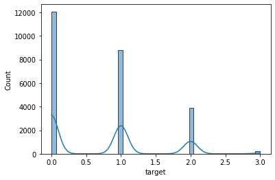
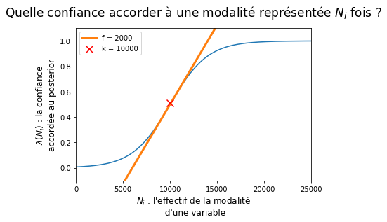
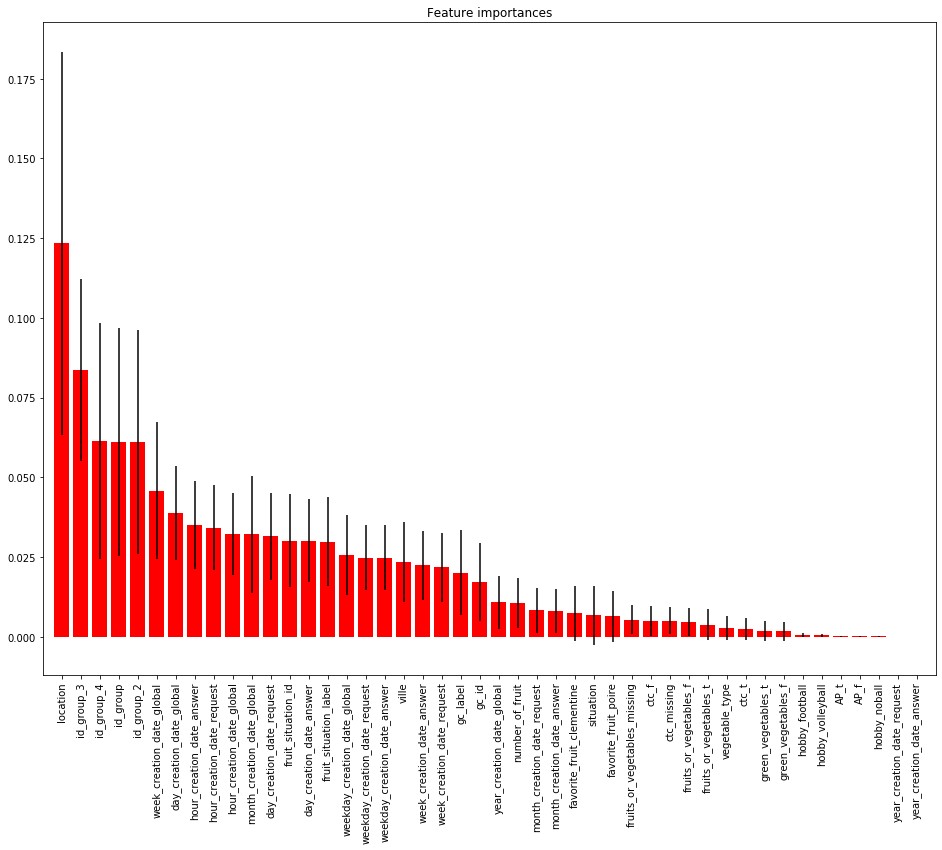
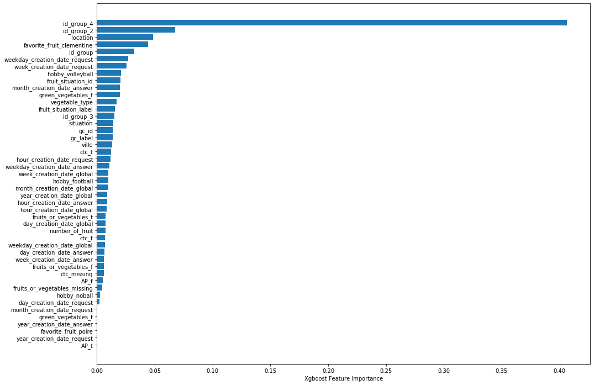

```python
%load_ext pycodestyle_magic
%flake8_on
```

    The pycodestyle_magic extension is already loaded. To reload it, use:
      %reload_ext pycodestyle_magic


```python
import pandas as pd
import numpy as np
import seaborn as sns

from sklearn.preprocessing import OneHotEncoder
from sklearn.preprocessing import LabelEncoder
from sklearn.metrics import log_loss
from sklearn.model_selection import train_test_split
from Target_encoder import target_encoding
import matplotlib.pyplot as plt
from sklearn.ensemble import RandomForestClassifier
from xgboost import XGBClassifier
from sklearn.model_selection import GridSearchCV, RandomizedSearchCV
from sklearn.metrics import confusion_matrix, classification_report

pd.set_option('display.max_columns', 100)
pd.set_option('display.width', 500)
np.random.seed(77)
```

# Chargement données


```python
# chargement base de train
df_train = pd.read_csv(
    'train.csv', sep=',',
    low_memory=False,
    error_bad_lines=False)
df_train.drop("id", axis=1, inplace=True)
print(df_train.shape)

# chargement base de test
df_test = pd.read_csv(
    'test.csv', sep=',',
    low_memory=False,
    error_bad_lines=False)
print(df_test.shape)
```

    (25000, 23)
    (25000, 23)


# Description et analyse du dataset


```python
df_train.target.value_counts(dropna=False)
```


    0    12077
    1     8816
    2     3874
    3      233
    Name: target, dtype: int64


```python
df_train.target.value_counts(normalize=True, dropna=False)
```


    0    0.48308
    1    0.35264
    2    0.15496
    3    0.00932
    Name: target, dtype: float64


```python
sns.histplot(df_train, x="target", kde=True)
```


    <matplotlib.axes._subplots.AxesSubplot at 0x7ff166d08390>




La variable cible contient 4 classes sur le jeu d'entrainement.
Les classes 2 et 3 sont sous representées.
classe 3 : 0.00932 => très rare
classe 2 : 0.15496
Les classes 1 et 2 representent plus du 3/4 du dataset de train.

```python
df_train.dtypes
```


    AP                       object
    creation_date_answer     object
    situation                 int64
    ctc                      object
    location                  int64
    gc_id                     int64
    gc_label                 object
    creation_date_global     object
    id_group                 object
    id_group_2               object
    favorite_fruit           object
    fruit_situation_id        int64
    fruit_situation_label    object
    fruits_or_vegetables     object
    number_of_fruit           int64
    id_group_3               object
    creation_date_request    object
    hobby                    object
    id_group_4               object
    ville                    object
    green_vegetables         object
    vegetable_type           object
    target                    int64
    dtype: object


Un jeu de données contenant majoritairement des données categorielles.

```python
df_train.astype('object').describe().transpose()
```


<div>
<style scoped>
    .dataframe tbody tr th:only-of-type {
        vertical-align: middle;
    }

    .dataframe tbody tr th {
        vertical-align: top;
    }

    .dataframe thead th {
        text-align: right;
    }
</style>
<table border="1" class="dataframe">
  <thead>
    <tr style="text-align: right;">
      <th></th>
      <th>count</th>
      <th>unique</th>
      <th>top</th>
      <th>freq</th>
    </tr>
  </thead>
  <tbody>
    <tr>
      <th>AP</th>
      <td>25000</td>
      <td>2</td>
      <td>f</td>
      <td>24914</td>
    </tr>
    <tr>
      <th>creation_date_answer</th>
      <td>25000</td>
      <td>24278</td>
      <td>2019-02-06 09:00:00</td>
      <td>10</td>
    </tr>
    <tr>
      <th>situation</th>
      <td>25000</td>
      <td>8</td>
      <td>-1</td>
      <td>23965</td>
    </tr>
    <tr>
      <th>ctc</th>
      <td>9620</td>
      <td>2</td>
      <td>f</td>
      <td>8991</td>
    </tr>
    <tr>
      <th>location</th>
      <td>25000</td>
      <td>99</td>
      <td>70</td>
      <td>1245</td>
    </tr>
    <tr>
      <th>gc_id</th>
      <td>25000</td>
      <td>12</td>
      <td>10</td>
      <td>13813</td>
    </tr>
    <tr>
      <th>gc_label</th>
      <td>25000</td>
      <td>12</td>
      <td>A</td>
      <td>13813</td>
    </tr>
    <tr>
      <th>creation_date_global</th>
      <td>25000</td>
      <td>15680</td>
      <td>2018-04-25 13:46:28.524</td>
      <td>14</td>
    </tr>
    <tr>
      <th>id_group</th>
      <td>25000</td>
      <td>15844</td>
      <td>9eac919417ab0</td>
      <td>14</td>
    </tr>
    <tr>
      <th>id_group_2</th>
      <td>25000</td>
      <td>15675</td>
      <td>12c9978a3bdfb</td>
      <td>14</td>
    </tr>
    <tr>
      <th>favorite_fruit</th>
      <td>25000</td>
      <td>2</td>
      <td>clementine</td>
      <td>18147</td>
    </tr>
    <tr>
      <th>fruit_situation_id</th>
      <td>25000</td>
      <td>22</td>
      <td>200</td>
      <td>10651</td>
    </tr>
    <tr>
      <th>fruit_situation_label</th>
      <td>23272</td>
      <td>21</td>
      <td>ag</td>
      <td>10651</td>
    </tr>
    <tr>
      <th>fruits_or_vegetables</th>
      <td>7659</td>
      <td>2</td>
      <td>f</td>
      <td>6394</td>
    </tr>
    <tr>
      <th>number_of_fruit</th>
      <td>25000</td>
      <td>9</td>
      <td>-1</td>
      <td>17918</td>
    </tr>
    <tr>
      <th>id_group_3</th>
      <td>25000</td>
      <td>872</td>
      <td>fa2eb9a81317a</td>
      <td>298</td>
    </tr>
    <tr>
      <th>creation_date_request</th>
      <td>25000</td>
      <td>24280</td>
      <td>2019-02-06 09:00:00</td>
      <td>10</td>
    </tr>
    <tr>
      <th>hobby</th>
      <td>25000</td>
      <td>3</td>
      <td>football</td>
      <td>24661</td>
    </tr>
    <tr>
      <th>id_group_4</th>
      <td>25000</td>
      <td>15831</td>
      <td>d51245edaef2b</td>
      <td>20</td>
    </tr>
    <tr>
      <th>ville</th>
      <td>8088</td>
      <td>564</td>
      <td>Saint-Étienne</td>
      <td>475</td>
    </tr>
    <tr>
      <th>green_vegetables</th>
      <td>25000</td>
      <td>2</td>
      <td>f</td>
      <td>24564</td>
    </tr>
    <tr>
      <th>vegetable_type</th>
      <td>414</td>
      <td>6</td>
      <td>green</td>
      <td>227</td>
    </tr>
    <tr>
      <th>target</th>
      <td>25000</td>
      <td>4</td>
      <td>0</td>
      <td>12077</td>
    </tr>
  </tbody>
</table>
</div>


Ce tableau descriptif, nous donnes les informations sur le nombre unique de modalité des variables et affiche la valeur la plus representée de chaque variable.

Il y'a la possibilité de créer de nouvelles features à partir des variables 
qui peuvent etre transformées au format date.
exemple : creation_date_request / creation_date_global.

Il y'a possibilité de créer des interactions entre les variables geographiques comme "ville" et "location". Location semble être le departement, donc possiblité de récuperer une carto externe pour rappatrier les regions de france ou d'autres données externes en fonction de la clé location.


```python
df_train.isnull().sum().sort_values(ascending = False)
```


    vegetable_type           24586
    fruits_or_vegetables     17341
    ville                    16912
    ctc                      15380
    fruit_situation_label     1728
    target                       0
    id_group                     0
    creation_date_answer         0
    situation                    0
    location                     0
    gc_id                        0
    gc_label                     0
    creation_date_global         0
    fruit_situation_id           0
    id_group_2                   0
    favorite_fruit               0
    number_of_fruit              0
    id_group_3                   0
    creation_date_request        0
    hobby                        0
    id_group_4                   0
    green_vegetables             0
    AP                           0
    dtype: int64


    1:46: E251 unexpected spaces around keyword / parameter equals
    1:48: E251 unexpected spaces around keyword / parameter equals

Classement des variables par valeurs manquantes decroissantes.

Les variables "vegetable_type", "fruits_or_vegetables", "ville", "ctc" sont très peu renseignées.

Pour les variables des données manquantes raisonnable (inferieur à 30%), plusieurs moyen d'imputation de données sont possibles:
    -Imputation par la moyenne ou par la mediane, 
    -Imputation par extrapolation lineaire (correlation entre variable à imputer et variable corrélé)
         Mettre en place un modele lineaire, si la tendance est linéaire, imputer les valeurs via l'equation de la droite.
     - Conservation des valeurs manquantes qui peuvent aussi apporter de l'information lors de la modélisation.
 
Des packages de sklearn "simple_imputer" existent aussi pour faciliter le traitement de données manquantes.

```python
var = 'vegetable_type'
df_train.groupby(var)['target'].agg(['mean', 'count', 'std'])
```


<div>
<style scoped>
    .dataframe tbody tr th:only-of-type {
        vertical-align: middle;
    }

    .dataframe tbody tr th {
        vertical-align: top;
    }

    .dataframe thead th {
        text-align: right;
    }
</style>
<table border="1" class="dataframe">
  <thead>
    <tr style="text-align: right;">
      <th></th>
      <th>mean</th>
      <th>count</th>
      <th>std</th>
    </tr>
    <tr>
      <th>vegetable_type</th>
      <th></th>
      <th></th>
      <th></th>
    </tr>
  </thead>
  <tbody>
    <tr>
      <th>almostgreen</th>
      <td>0.000000</td>
      <td>4</td>
      <td>0.000000</td>
    </tr>
    <tr>
      <th>green</th>
      <td>0.832599</td>
      <td>227</td>
      <td>0.925640</td>
    </tr>
    <tr>
      <th>notsogreen</th>
      <td>1.171429</td>
      <td>35</td>
      <td>0.785370</td>
    </tr>
    <tr>
      <th>prettygreen</th>
      <td>1.300000</td>
      <td>10</td>
      <td>1.059350</td>
    </tr>
    <tr>
      <th>salad</th>
      <td>1.007519</td>
      <td>133</td>
      <td>0.941439</td>
    </tr>
    <tr>
      <th>verygreen</th>
      <td>1.000000</td>
      <td>5</td>
      <td>1.000000</td>
    </tr>
  </tbody>
</table>
</div>


```python
df_train.vegetable_type.value_counts(normalize=True, dropna=False)
```


    NaN            0.98344
    green          0.00908
    salad          0.00532
    notsogreen     0.00140
    prettygreen    0.00040
    verygreen      0.00020
    almostgreen    0.00016
    Name: vegetable_type, dtype: float64


Nous pouvons nous poser la question de supprimer la variable vegetable_type qui est extrement mal renseignée et qui de premier abord ne pourra pas apporter de signal pour le modele.

Cependant, je vais decider de la conserver car l'objectif est de classifier des données désequilibrées et nous avons pu voir que les classes 2 et 3 sont très rares. 

Le modele pourrait extraire un peu d'information des quelques valeurs renseignés de cette variable qui pourrait être utilise à la prediction des classes 2 et 3.

```python

```


```python
df_train.groupby('target').agg({'fruits_or_vegetables': 'value_counts'})
```


<div>
<style scoped>
    .dataframe tbody tr th:only-of-type {
        vertical-align: middle;
    }

    .dataframe tbody tr th {
        vertical-align: top;
    }

    .dataframe thead th {
        text-align: right;
    }
</style>
<table border="1" class="dataframe">
  <thead>
    <tr style="text-align: right;">
      <th></th>
      <th></th>
      <th>fruits_or_vegetables</th>
    </tr>
    <tr>
      <th>target</th>
      <th>fruits_or_vegetables</th>
      <th></th>
    </tr>
  </thead>
  <tbody>
    <tr>
      <th rowspan="2" valign="top">0</th>
      <th>f</th>
      <td>3137</td>
    </tr>
    <tr>
      <th>t</th>
      <td>619</td>
    </tr>
    <tr>
      <th rowspan="2" valign="top">1</th>
      <th>f</th>
      <td>2298</td>
    </tr>
    <tr>
      <th>t</th>
      <td>415</td>
    </tr>
    <tr>
      <th rowspan="2" valign="top">2</th>
      <th>f</th>
      <td>918</td>
    </tr>
    <tr>
      <th>t</th>
      <td>210</td>
    </tr>
    <tr>
      <th rowspan="2" valign="top">3</th>
      <th>f</th>
      <td>41</td>
    </tr>
    <tr>
      <th>t</th>
      <td>21</td>
    </tr>
  </tbody>
</table>
</div>


La variable fruits_or_vegetables est trés peu renseignés.
Pour appuyer le fait de garder cette variable, je voulais voir si dans les classes 2 et 3 etaient bien alimentés pour que le modèle puisse extraire du signal sur cette variable.
Je vais quand même la conserver dans un premier temps.

# Nettoyage des données et création des features

## Gestion des  dates


```python
# fonction pour parser une date
def parsing_date(df, column):
    
    df[f'day_{column}'] = df[column].dt.day
    df[f'week_{column}'] = df[column].dt.week
    df[f'month_{column}'] = df[column].dt.month
    df[f'year_{column}'] = df[column].dt.year
    df[f'hour_{column}'] = df[column].dt.hour
    df[f'weekday_{column}'] = df[column].dt.weekday
    return df

date_columns = [col for col in df_train.columns if "date" in col]

# fonction pour appliquer les transformations sur base de train et de test
def create_date_columns(df, columns):
    
    for date_col in columns:
        df[date_col] = pd.to_datetime(df[date_col])
        df = parsing_date(df, date_col)
        df.drop(date_col, axis=1, inplace=True)
    return df

df_test = create_date_columns(df_test, date_columns)
df_train = create_date_columns(df_train, date_columns)                    
```

    3:1: W293 blank line contains whitespace
    12:1: E305 expected 2 blank lines after class or function definition, found 1
    15:1: E302 expected 2 blank lines, found 1
    16:1: W293 blank line contains whitespace
    23:1: E305 expected 2 blank lines after class or function definition, found 1


## Gestion des données catégorielles


```python
# Identification des variables de type objet.
var_to_encode = df_train.select_dtypes(include=object).columns
```


```python
var_to_encode
```


    Index(['AP', 'ctc', 'gc_label', 'id_group', 'id_group_2', 'favorite_fruit', 'fruit_situation_label', 'fruits_or_vegetables', 'id_group_3', 'hobby', 'id_group_4', 'ville', 'green_vegetables', 'vegetable_type'], dtype='object')


```python
df_train[var_to_encode].describe().T
```


<div>
<style scoped>
    .dataframe tbody tr th:only-of-type {
        vertical-align: middle;
    }

    .dataframe tbody tr th {
        vertical-align: top;
    }

    .dataframe thead th {
        text-align: right;
    }
</style>
<table border="1" class="dataframe">
  <thead>
    <tr style="text-align: right;">
      <th></th>
      <th>count</th>
      <th>unique</th>
      <th>top</th>
      <th>freq</th>
    </tr>
  </thead>
  <tbody>
    <tr>
      <th>AP</th>
      <td>25000</td>
      <td>2</td>
      <td>f</td>
      <td>24914</td>
    </tr>
    <tr>
      <th>ctc</th>
      <td>9620</td>
      <td>2</td>
      <td>f</td>
      <td>8991</td>
    </tr>
    <tr>
      <th>gc_label</th>
      <td>25000</td>
      <td>12</td>
      <td>A</td>
      <td>13813</td>
    </tr>
    <tr>
      <th>id_group</th>
      <td>25000</td>
      <td>15844</td>
      <td>9eac919417ab0</td>
      <td>14</td>
    </tr>
    <tr>
      <th>id_group_2</th>
      <td>25000</td>
      <td>15675</td>
      <td>12c9978a3bdfb</td>
      <td>14</td>
    </tr>
    <tr>
      <th>favorite_fruit</th>
      <td>25000</td>
      <td>2</td>
      <td>clementine</td>
      <td>18147</td>
    </tr>
    <tr>
      <th>fruit_situation_label</th>
      <td>23272</td>
      <td>21</td>
      <td>ag</td>
      <td>10651</td>
    </tr>
    <tr>
      <th>fruits_or_vegetables</th>
      <td>7659</td>
      <td>2</td>
      <td>f</td>
      <td>6394</td>
    </tr>
    <tr>
      <th>id_group_3</th>
      <td>25000</td>
      <td>872</td>
      <td>fa2eb9a81317a</td>
      <td>298</td>
    </tr>
    <tr>
      <th>hobby</th>
      <td>25000</td>
      <td>3</td>
      <td>football</td>
      <td>24661</td>
    </tr>
    <tr>
      <th>id_group_4</th>
      <td>25000</td>
      <td>15831</td>
      <td>d51245edaef2b</td>
      <td>20</td>
    </tr>
    <tr>
      <th>ville</th>
      <td>8088</td>
      <td>564</td>
      <td>Saint-Étienne</td>
      <td>475</td>
    </tr>
    <tr>
      <th>green_vegetables</th>
      <td>25000</td>
      <td>2</td>
      <td>f</td>
      <td>24564</td>
    </tr>
    <tr>
      <th>vegetable_type</th>
      <td>414</td>
      <td>6</td>
      <td>green</td>
      <td>227</td>
    </tr>
  </tbody>
</table>
</div>


#  Encoding
2 techniques d'encoding vont être appliqués:

Application du target encoding sur les données categorielles à plus de 3 modalités.
Avantage du target encoding : eviter l'ordinalite que pourrait apporter un encodage du type label encoding

Application du one hot encoding sur les variables avec moins de 4 modalités.

```python
var_to_encode_describe = df_train[var_to_encode].describe().T
```


```python
# Recuperer dans un objet les noms de variables.
# pour lesquelles un one hot encoding sera appliqué
var_to_one_hot = var_to_encode_describe[var_to_encode_describe.unique <= 3].index
```


```python
# Gestion des données manquantes avec un fillna par la modalité missing.
# Le ohe créera une colonne specifique pour les données manquantes.
# Un modele peut extraire de l'information sur des données non renseignés.

df_train[var_to_one_hot] = df_train[var_to_one_hot].fillna("missing")
df_test[var_to_one_hot] = df_test[var_to_one_hot].fillna("missing")
```

## One hot encoding


```python
# Application du ohe
drop_enc = OneHotEncoder().fit(df_train[var_to_one_hot])

df_train_ohe = drop_enc.transform(df_train[var_to_one_hot])
df_test_ohe = drop_enc.transform(df_test[var_to_one_hot])
```


```python
# Transformation de la matrice en format dataframe
# concatenation des colonnes encodées
# Suppression des variables originales

df_train.drop(var_to_one_hot, axis=1, inplace=True)

df_train_ohe = pd.concat([pd.DataFrame.sparse.from_spmatrix
                          (df_train_ohe,
                           columns=drop_enc.get_feature_names_out()),
                           df_train],
                        axis=1)

df_test.drop(var_to_one_hot, axis=1, inplace=True)

df_test_ohe = pd.concat([pd.DataFrame.sparse.from_spmatrix
                         (df_test_ohe, 
                        columns=drop_enc.get_feature_names_out()),
                        df_test], axis=1)


```

    10:28: E127 continuation line over-indented for visual indent
    11:25: E128 continuation line under-indented for visual indent
    16:39: W291 trailing whitespace
    17:25: E128 continuation line under-indented for visual indent


```python
# resultat du one hot encoding
df_train_ohe
```


<div>
<style scoped>
    .dataframe tbody tr th:only-of-type {
        vertical-align: middle;
    }

    .dataframe tbody tr th {
        vertical-align: top;
    }

    .dataframe thead th {
        text-align: right;
    }
</style>
<table border="1" class="dataframe">
  <thead>
    <tr style="text-align: right;">
      <th></th>
      <th>AP_f</th>
      <th>AP_t</th>
      <th>ctc_f</th>
      <th>ctc_missing</th>
      <th>ctc_t</th>
      <th>favorite_fruit_clementine</th>
      <th>favorite_fruit_poire</th>
      <th>fruits_or_vegetables_f</th>
      <th>fruits_or_vegetables_missing</th>
      <th>fruits_or_vegetables_t</th>
      <th>hobby_football</th>
      <th>hobby_noball</th>
      <th>hobby_volleyball</th>
      <th>green_vegetables_f</th>
      <th>green_vegetables_t</th>
      <th>situation</th>
      <th>location</th>
      <th>gc_id</th>
      <th>gc_label</th>
      <th>id_group</th>
      <th>id_group_2</th>
      <th>fruit_situation_id</th>
      <th>fruit_situation_label</th>
      <th>number_of_fruit</th>
      <th>id_group_3</th>
      <th>id_group_4</th>
      <th>ville</th>
      <th>vegetable_type</th>
      <th>target</th>
      <th>day_creation_date_answer</th>
      <th>week_creation_date_answer</th>
      <th>month_creation_date_answer</th>
      <th>year_creation_date_answer</th>
      <th>hour_creation_date_answer</th>
      <th>weekday_creation_date_answer</th>
      <th>day_creation_date_global</th>
      <th>week_creation_date_global</th>
      <th>month_creation_date_global</th>
      <th>year_creation_date_global</th>
      <th>hour_creation_date_global</th>
      <th>weekday_creation_date_global</th>
      <th>day_creation_date_request</th>
      <th>week_creation_date_request</th>
      <th>month_creation_date_request</th>
      <th>year_creation_date_request</th>
      <th>hour_creation_date_request</th>
      <th>weekday_creation_date_request</th>
    </tr>
  </thead>
  <tbody>
    <tr>
      <th>0</th>
      <td>1.0</td>
      <td>0.0</td>
      <td>0.0</td>
      <td>1.0</td>
      <td>0.0</td>
      <td>0.0</td>
      <td>1.0</td>
      <td>0.0</td>
      <td>1.0</td>
      <td>0.0</td>
      <td>1.0</td>
      <td>0.0</td>
      <td>0.0</td>
      <td>1.0</td>
      <td>0.0</td>
      <td>-1</td>
      <td>52</td>
      <td>70</td>
      <td>G</td>
      <td>2d7e206d46ea1</td>
      <td>36bac09400660</td>
      <td>120</td>
      <td>jzy</td>
      <td>-1</td>
      <td>812a43d710ace</td>
      <td>aa8f4934a31eb</td>
      <td>NaN</td>
      <td>NaN</td>
      <td>0</td>
      <td>13</td>
      <td>11</td>
      <td>3</td>
      <td>2019</td>
      <td>11</td>
      <td>2</td>
      <td>17</td>
      <td>3</td>
      <td>1</td>
      <td>2019</td>
      <td>10</td>
      <td>3</td>
      <td>13</td>
      <td>11</td>
      <td>3</td>
      <td>2019</td>
      <td>11</td>
      <td>2</td>
    </tr>
    <tr>
      <th>1</th>
      <td>1.0</td>
      <td>0.0</td>
      <td>0.0</td>
      <td>1.0</td>
      <td>0.0</td>
      <td>1.0</td>
      <td>0.0</td>
      <td>0.0</td>
      <td>1.0</td>
      <td>0.0</td>
      <td>1.0</td>
      <td>0.0</td>
      <td>0.0</td>
      <td>1.0</td>
      <td>0.0</td>
      <td>-1</td>
      <td>78</td>
      <td>10</td>
      <td>A</td>
      <td>35e96d6848871</td>
      <td>80a697d593706</td>
      <td>10</td>
      <td>ae</td>
      <td>-1</td>
      <td>4b59257f24573</td>
      <td>6ff9ea9ec85fd</td>
      <td>NaN</td>
      <td>NaN</td>
      <td>1</td>
      <td>21</td>
      <td>12</td>
      <td>3</td>
      <td>2019</td>
      <td>14</td>
      <td>3</td>
      <td>20</td>
      <td>34</td>
      <td>8</td>
      <td>2018</td>
      <td>5</td>
      <td>0</td>
      <td>21</td>
      <td>12</td>
      <td>3</td>
      <td>2019</td>
      <td>14</td>
      <td>3</td>
    </tr>
    <tr>
      <th>2</th>
      <td>1.0</td>
      <td>0.0</td>
      <td>0.0</td>
      <td>1.0</td>
      <td>0.0</td>
      <td>1.0</td>
      <td>0.0</td>
      <td>0.0</td>
      <td>1.0</td>
      <td>0.0</td>
      <td>1.0</td>
      <td>0.0</td>
      <td>0.0</td>
      <td>1.0</td>
      <td>0.0</td>
      <td>-1</td>
      <td>70</td>
      <td>10</td>
      <td>A</td>
      <td>ffaf8085e383d</td>
      <td>c309176b96268</td>
      <td>200</td>
      <td>ag</td>
      <td>-1</td>
      <td>f1a838f0d194b</td>
      <td>6a49a0a97b049</td>
      <td>NaN</td>
      <td>NaN</td>
      <td>0</td>
      <td>15</td>
      <td>11</td>
      <td>3</td>
      <td>2019</td>
      <td>17</td>
      <td>4</td>
      <td>20</td>
      <td>51</td>
      <td>12</td>
      <td>2018</td>
      <td>13</td>
      <td>3</td>
      <td>15</td>
      <td>11</td>
      <td>3</td>
      <td>2019</td>
      <td>17</td>
      <td>4</td>
    </tr>
    <tr>
      <th>3</th>
      <td>1.0</td>
      <td>0.0</td>
      <td>1.0</td>
      <td>0.0</td>
      <td>0.0</td>
      <td>1.0</td>
      <td>0.0</td>
      <td>0.0</td>
      <td>1.0</td>
      <td>0.0</td>
      <td>1.0</td>
      <td>0.0</td>
      <td>0.0</td>
      <td>1.0</td>
      <td>0.0</td>
      <td>-1</td>
      <td>84</td>
      <td>10</td>
      <td>A</td>
      <td>5360cf0a40ce3</td>
      <td>13c1a3597648b</td>
      <td>10</td>
      <td>ae</td>
      <td>0</td>
      <td>c3196847d1c14</td>
      <td>d0dcf1ca1bf04</td>
      <td>NaN</td>
      <td>NaN</td>
      <td>1</td>
      <td>7</td>
      <td>2</td>
      <td>1</td>
      <td>2019</td>
      <td>8</td>
      <td>0</td>
      <td>21</td>
      <td>29</td>
      <td>7</td>
      <td>2018</td>
      <td>10</td>
      <td>5</td>
      <td>7</td>
      <td>2</td>
      <td>1</td>
      <td>2019</td>
      <td>8</td>
      <td>0</td>
    </tr>
    <tr>
      <th>4</th>
      <td>1.0</td>
      <td>0.0</td>
      <td>0.0</td>
      <td>1.0</td>
      <td>0.0</td>
      <td>1.0</td>
      <td>0.0</td>
      <td>0.0</td>
      <td>1.0</td>
      <td>0.0</td>
      <td>1.0</td>
      <td>0.0</td>
      <td>0.0</td>
      <td>1.0</td>
      <td>0.0</td>
      <td>-1</td>
      <td>29</td>
      <td>20</td>
      <td>D</td>
      <td>126c3211f23fc</td>
      <td>7b68e0a456571</td>
      <td>10</td>
      <td>ae</td>
      <td>-1</td>
      <td>70e18c6fe58cd</td>
      <td>b4870b1c8eb42</td>
      <td>NaN</td>
      <td>NaN</td>
      <td>1</td>
      <td>3</td>
      <td>5</td>
      <td>2</td>
      <td>2019</td>
      <td>17</td>
      <td>6</td>
      <td>7</td>
      <td>49</td>
      <td>12</td>
      <td>2018</td>
      <td>19</td>
      <td>4</td>
      <td>3</td>
      <td>5</td>
      <td>2</td>
      <td>2019</td>
      <td>17</td>
      <td>6</td>
    </tr>
    <tr>
      <th>...</th>
      <td>...</td>
      <td>...</td>
      <td>...</td>
      <td>...</td>
      <td>...</td>
      <td>...</td>
      <td>...</td>
      <td>...</td>
      <td>...</td>
      <td>...</td>
      <td>...</td>
      <td>...</td>
      <td>...</td>
      <td>...</td>
      <td>...</td>
      <td>...</td>
      <td>...</td>
      <td>...</td>
      <td>...</td>
      <td>...</td>
      <td>...</td>
      <td>...</td>
      <td>...</td>
      <td>...</td>
      <td>...</td>
      <td>...</td>
      <td>...</td>
      <td>...</td>
      <td>...</td>
      <td>...</td>
      <td>...</td>
      <td>...</td>
      <td>...</td>
      <td>...</td>
      <td>...</td>
      <td>...</td>
      <td>...</td>
      <td>...</td>
      <td>...</td>
      <td>...</td>
      <td>...</td>
      <td>...</td>
      <td>...</td>
      <td>...</td>
      <td>...</td>
      <td>...</td>
      <td>...</td>
    </tr>
    <tr>
      <th>24995</th>
      <td>1.0</td>
      <td>0.0</td>
      <td>0.0</td>
      <td>1.0</td>
      <td>0.0</td>
      <td>1.0</td>
      <td>0.0</td>
      <td>0.0</td>
      <td>1.0</td>
      <td>0.0</td>
      <td>1.0</td>
      <td>0.0</td>
      <td>0.0</td>
      <td>1.0</td>
      <td>0.0</td>
      <td>-1</td>
      <td>17</td>
      <td>10</td>
      <td>A</td>
      <td>07d568301bae5</td>
      <td>8ed90715244e0</td>
      <td>160</td>
      <td>zht</td>
      <td>-1</td>
      <td>7f9b9fe72ad1b</td>
      <td>97de0f5d0b0cf</td>
      <td>NaN</td>
      <td>NaN</td>
      <td>0</td>
      <td>21</td>
      <td>12</td>
      <td>3</td>
      <td>2019</td>
      <td>16</td>
      <td>3</td>
      <td>16</td>
      <td>11</td>
      <td>3</td>
      <td>2019</td>
      <td>10</td>
      <td>5</td>
      <td>21</td>
      <td>12</td>
      <td>3</td>
      <td>2019</td>
      <td>16</td>
      <td>3</td>
    </tr>
    <tr>
      <th>24996</th>
      <td>1.0</td>
      <td>0.0</td>
      <td>0.0</td>
      <td>1.0</td>
      <td>0.0</td>
      <td>1.0</td>
      <td>0.0</td>
      <td>0.0</td>
      <td>1.0</td>
      <td>0.0</td>
      <td>1.0</td>
      <td>0.0</td>
      <td>0.0</td>
      <td>1.0</td>
      <td>0.0</td>
      <td>-1</td>
      <td>93</td>
      <td>10</td>
      <td>A</td>
      <td>ecf26c2e00203</td>
      <td>5f820a5b9c8cd</td>
      <td>10</td>
      <td>ae</td>
      <td>-1</td>
      <td>5918a05e76cfe</td>
      <td>0aac6e868db10</td>
      <td>NaN</td>
      <td>NaN</td>
      <td>1</td>
      <td>15</td>
      <td>7</td>
      <td>2</td>
      <td>2019</td>
      <td>21</td>
      <td>4</td>
      <td>15</td>
      <td>37</td>
      <td>9</td>
      <td>2018</td>
      <td>9</td>
      <td>5</td>
      <td>15</td>
      <td>7</td>
      <td>2</td>
      <td>2019</td>
      <td>21</td>
      <td>4</td>
    </tr>
    <tr>
      <th>24997</th>
      <td>1.0</td>
      <td>0.0</td>
      <td>1.0</td>
      <td>0.0</td>
      <td>0.0</td>
      <td>1.0</td>
      <td>0.0</td>
      <td>0.0</td>
      <td>1.0</td>
      <td>0.0</td>
      <td>1.0</td>
      <td>0.0</td>
      <td>0.0</td>
      <td>1.0</td>
      <td>0.0</td>
      <td>-1</td>
      <td>68</td>
      <td>10</td>
      <td>A</td>
      <td>c84066a550a3a</td>
      <td>6532597956225</td>
      <td>200</td>
      <td>ag</td>
      <td>0</td>
      <td>50101f6881261</td>
      <td>89c8a90e0ce38</td>
      <td>NaN</td>
      <td>NaN</td>
      <td>0</td>
      <td>3</td>
      <td>1</td>
      <td>1</td>
      <td>2019</td>
      <td>10</td>
      <td>3</td>
      <td>20</td>
      <td>38</td>
      <td>9</td>
      <td>2018</td>
      <td>13</td>
      <td>3</td>
      <td>3</td>
      <td>1</td>
      <td>1</td>
      <td>2019</td>
      <td>10</td>
      <td>3</td>
    </tr>
    <tr>
      <th>24998</th>
      <td>1.0</td>
      <td>0.0</td>
      <td>1.0</td>
      <td>0.0</td>
      <td>0.0</td>
      <td>1.0</td>
      <td>0.0</td>
      <td>0.0</td>
      <td>0.0</td>
      <td>1.0</td>
      <td>1.0</td>
      <td>0.0</td>
      <td>0.0</td>
      <td>1.0</td>
      <td>0.0</td>
      <td>-1</td>
      <td>78</td>
      <td>20</td>
      <td>D</td>
      <td>98e8126974bad</td>
      <td>8aa3d8d3a97d3</td>
      <td>200</td>
      <td>ag</td>
      <td>0</td>
      <td>0f1a3e137c5ea</td>
      <td>0157899906f02</td>
      <td>Moissy-Cramayel</td>
      <td>NaN</td>
      <td>1</td>
      <td>17</td>
      <td>3</td>
      <td>1</td>
      <td>2019</td>
      <td>12</td>
      <td>3</td>
      <td>4</td>
      <td>44</td>
      <td>11</td>
      <td>2018</td>
      <td>17</td>
      <td>6</td>
      <td>17</td>
      <td>3</td>
      <td>1</td>
      <td>2019</td>
      <td>12</td>
      <td>3</td>
    </tr>
    <tr>
      <th>24999</th>
      <td>1.0</td>
      <td>0.0</td>
      <td>0.0</td>
      <td>1.0</td>
      <td>0.0</td>
      <td>1.0</td>
      <td>0.0</td>
      <td>0.0</td>
      <td>1.0</td>
      <td>0.0</td>
      <td>1.0</td>
      <td>0.0</td>
      <td>0.0</td>
      <td>1.0</td>
      <td>0.0</td>
      <td>-1</td>
      <td>60</td>
      <td>10</td>
      <td>A</td>
      <td>1707d41f20deb</td>
      <td>8cd910513240b</td>
      <td>200</td>
      <td>ag</td>
      <td>0</td>
      <td>7232a3a11e532</td>
      <td>fbb2e051ded47</td>
      <td>NaN</td>
      <td>NaN</td>
      <td>0</td>
      <td>26</td>
      <td>9</td>
      <td>2</td>
      <td>2019</td>
      <td>9</td>
      <td>1</td>
      <td>11</td>
      <td>41</td>
      <td>10</td>
      <td>2018</td>
      <td>14</td>
      <td>3</td>
      <td>26</td>
      <td>9</td>
      <td>2</td>
      <td>2019</td>
      <td>9</td>
      <td>1</td>
    </tr>
  </tbody>
</table>
<p>25000 rows × 47 columns</p>
</div>


```python
# passage de la variable id en index, car ne doit pas être encoder
df_test_ohe = df_test_ohe.set_index('id')

```

## Target encoding


```python
var_to_te = var_to_encode_describe[var_to_encode_describe.unique > 3].index
```


```python
var_to_te
```


    Index(['gc_label', 'id_group', 'id_group_2', 'fruit_situation_label', 'id_group_3', 'id_group_4', 'ville', 'vegetable_type'], dtype='object')


Target encoding, est une technique d'encodage de variable.
Encode une variable catégorielle non ordinale à haute cardinalité à l'aide de la distribution CONTINUE ou BINAIRE de la variable cible à predire.

Le principe est de faire "confiance" à une modalité Xi quand elle contient suffisamment d'observations : l'
l'encoding s'approchera de E[Y | X=Xi], elle affectera pour la valeur à encoder la valeur moyenne de la target de la sous population de confiance.
À l'inverse, si une modalité Xi n'est prise que par quelques observations, on préfèrera faire confiance à la statistique globale E[Y] sur tout le train.

# Exemple sur une variable à encoder


```python
prior = df_train.target.mean()
print('Prior (moyenne de la cible à prédire) =', prior)

var = 'gc_label'
df_train.groupby(var)['target'].agg(['mean', 'count', 'std'])
```

    Prior (moyenne de la cible à prédire) = 0.69052


<div>
<style scoped>
    .dataframe tbody tr th:only-of-type {
        vertical-align: middle;
    }

    .dataframe tbody tr th {
        vertical-align: top;
    }

    .dataframe thead th {
        text-align: right;
    }
</style>
<table border="1" class="dataframe">
  <thead>
    <tr style="text-align: right;">
      <th></th>
      <th>mean</th>
      <th>count</th>
      <th>std</th>
    </tr>
    <tr>
      <th>gc_label</th>
      <th></th>
      <th></th>
      <th></th>
    </tr>
  </thead>
  <tbody>
    <tr>
      <th>A</th>
      <td>0.644321</td>
      <td>13813</td>
      <td>0.699465</td>
    </tr>
    <tr>
      <th>B</th>
      <td>0.912796</td>
      <td>2282</td>
      <td>0.927359</td>
    </tr>
    <tr>
      <th>C</th>
      <td>0.506329</td>
      <td>948</td>
      <td>0.705209</td>
    </tr>
    <tr>
      <th>D</th>
      <td>0.756357</td>
      <td>3854</td>
      <td>0.756359</td>
    </tr>
    <tr>
      <th>E</th>
      <td>0.856209</td>
      <td>153</td>
      <td>0.764494</td>
    </tr>
    <tr>
      <th>F</th>
      <td>0.461538</td>
      <td>13</td>
      <td>0.776250</td>
    </tr>
    <tr>
      <th>G</th>
      <td>0.487619</td>
      <td>525</td>
      <td>0.684018</td>
    </tr>
    <tr>
      <th>H</th>
      <td>0.750674</td>
      <td>2226</td>
      <td>0.874771</td>
    </tr>
    <tr>
      <th>I</th>
      <td>0.676829</td>
      <td>164</td>
      <td>0.813505</td>
    </tr>
    <tr>
      <th>J</th>
      <td>0.000000</td>
      <td>2</td>
      <td>0.000000</td>
    </tr>
    <tr>
      <th>K</th>
      <td>0.670732</td>
      <td>328</td>
      <td>0.700456</td>
    </tr>
    <tr>
      <th>L</th>
      <td>0.708092</td>
      <td>692</td>
      <td>0.896233</td>
    </tr>
  </tbody>
</table>
</div>


La variable gc_label contient 12 modalités (lettre A jusqu'a L). 
Nous pouvons visualiser les valeurs moyennes, de nombre et d'ecart type de chacune de ces lettres calculées en fonction de la target.

La moyenne (Prior) de la target est de 0,69052. L'ojectif est maintenant de remplacer chacune de ces modalités par une valeurs moyenne que l'on va associé en fonction de la variable cible et de "l'effet de confiance".

```python
# Application de la fonction target encoding

encoding_gc_label, mapping_gc_label = target_encoding(df_train,
                                    serie='gc_label',
                                    target_name='target',
                                    k=10000,
                                    f=2000,
                                    avec_viz=True,
                                    noise_level=0)
```





    4:37: E128 continuation line under-indented for visual indent
    5:37: E128 continuation line under-indented for visual indent
    6:37: E128 continuation line under-indented for visual indent
    7:37: E128 continuation line under-indented for visual indent
    8:37: E128 continuation line under-indented for visual indent
    9:37: E128 continuation line under-indented for visual indent

Ce graphe permet de determiner le seuil de confiance k à definir 
pour permettre le calcul du prior pour les modalités à encoder.

Par exemple, la modalité A est representé 13813 fois dans le dataset de train, si l'on fixe un seuil K de 10000, nous pouvons voir que la confiance accordée est d'uniquement de 50 %. Ce qui signifie que pour le calcul du prior(moyenne) à affecter à la modalité A.

Ce qui donne, $Enconding(A) = 0,5*prior + 0,5*posterior
$prior = mean(y) dans le groupe de la modalité A.
Mais sans utiliser la ligne en cours (bannir l'effet de la target directement sur la ligne a encoder).

Le target encoding permet aussi de gerer les valeurs manquantes en appliquants la valeur moyenne de la target aux valeurs manquantes

```python
# resultat de l'encoding
mapping_gc_label
```


    {'A': 0.6502975992746985,
     'B': 0.6951107763128783,
     'C': 0.6885476870940799,
     'D': 0.6934322892265472,
     'E': 0.6917164587368099,
     'F': 0.6889775340693239,
     'G': 0.6887579188690934,
     'H': 0.6917287734642878,
     'I': 0.6904205965086627,
     'J': 0.685893859698352,
     'K': 0.6903641430867458,
     'L': 0.6906857716546099,
     nan: 0.69052}


Par manque de temps, nous allons appliquer le meme seuil de confiance à toutes les variables à encoder.

```python
te_mapping = {}

for var in var_to_te:
    encoding, mapping = target_encoding(df_train, serie=var,
                                        target_name='target',
                                        k = 10000,
                                        f = 2000,
                                        avec_viz=False, noise_level=0)
    te_mapping[var]= mapping
```

    6:42: E251 unexpected spaces around keyword / parameter equals
    6:44: E251 unexpected spaces around keyword / parameter equals
    7:42: E251 unexpected spaces around keyword / parameter equals
    7:44: E251 unexpected spaces around keyword / parameter equals
    9:20: E225 missing whitespace around operator


```python
def build_df_encoding(df, te_mapping):
    for var, mapping in te_mapping.items():
        df[var] = df[var].map(mapping)
    return df
```


```python
df_train_te = build_df_encoding(df_train_ohe, te_mapping)
df_test_te = build_df_encoding(df_test_ohe, te_mapping)
```


```python
print(df_train_te.shape)
print(df_test_te.shape)
```

    (25000, 47)
    (25000, 46)


```python
df_train_te.head(3)
```


<div>
<style scoped>
    .dataframe tbody tr th:only-of-type {
        vertical-align: middle;
    }

    .dataframe tbody tr th {
        vertical-align: top;
    }

    .dataframe thead th {
        text-align: right;
    }
</style>
<table border="1" class="dataframe">
  <thead>
    <tr style="text-align: right;">
      <th></th>
      <th>AP_f</th>
      <th>AP_t</th>
      <th>ctc_f</th>
      <th>ctc_missing</th>
      <th>ctc_t</th>
      <th>favorite_fruit_clementine</th>
      <th>favorite_fruit_poire</th>
      <th>fruits_or_vegetables_f</th>
      <th>fruits_or_vegetables_missing</th>
      <th>fruits_or_vegetables_t</th>
      <th>hobby_football</th>
      <th>hobby_noball</th>
      <th>hobby_volleyball</th>
      <th>green_vegetables_f</th>
      <th>green_vegetables_t</th>
      <th>situation</th>
      <th>location</th>
      <th>gc_id</th>
      <th>gc_label</th>
      <th>id_group</th>
      <th>id_group_2</th>
      <th>fruit_situation_id</th>
      <th>fruit_situation_label</th>
      <th>number_of_fruit</th>
      <th>id_group_3</th>
      <th>id_group_4</th>
      <th>ville</th>
      <th>vegetable_type</th>
      <th>target</th>
      <th>day_creation_date_answer</th>
      <th>week_creation_date_answer</th>
      <th>month_creation_date_answer</th>
      <th>year_creation_date_answer</th>
      <th>hour_creation_date_answer</th>
      <th>weekday_creation_date_answer</th>
      <th>day_creation_date_global</th>
      <th>week_creation_date_global</th>
      <th>month_creation_date_global</th>
      <th>year_creation_date_global</th>
      <th>hour_creation_date_global</th>
      <th>weekday_creation_date_global</th>
      <th>day_creation_date_request</th>
      <th>week_creation_date_request</th>
      <th>month_creation_date_request</th>
      <th>year_creation_date_request</th>
      <th>hour_creation_date_request</th>
      <th>weekday_creation_date_request</th>
    </tr>
  </thead>
  <tbody>
    <tr>
      <th>0</th>
      <td>1.0</td>
      <td>0.0</td>
      <td>0.0</td>
      <td>1.0</td>
      <td>0.0</td>
      <td>0.0</td>
      <td>1.0</td>
      <td>0.0</td>
      <td>1.0</td>
      <td>0.0</td>
      <td>1.0</td>
      <td>0.0</td>
      <td>0.0</td>
      <td>1.0</td>
      <td>0.0</td>
      <td>-1</td>
      <td>52</td>
      <td>70</td>
      <td>0.688758</td>
      <td>0.685894</td>
      <td>0.685894</td>
      <td>120</td>
      <td>0.686462</td>
      <td>-1</td>
      <td>0.685869</td>
      <td>0.685894</td>
      <td>0.69052</td>
      <td>0.69052</td>
      <td>0</td>
      <td>13</td>
      <td>11</td>
      <td>3</td>
      <td>2019</td>
      <td>11</td>
      <td>2</td>
      <td>17</td>
      <td>3</td>
      <td>1</td>
      <td>2019</td>
      <td>10</td>
      <td>3</td>
      <td>13</td>
      <td>11</td>
      <td>3</td>
      <td>2019</td>
      <td>11</td>
      <td>2</td>
    </tr>
    <tr>
      <th>1</th>
      <td>1.0</td>
      <td>0.0</td>
      <td>0.0</td>
      <td>1.0</td>
      <td>0.0</td>
      <td>1.0</td>
      <td>0.0</td>
      <td>0.0</td>
      <td>1.0</td>
      <td>0.0</td>
      <td>1.0</td>
      <td>0.0</td>
      <td>0.0</td>
      <td>1.0</td>
      <td>0.0</td>
      <td>-1</td>
      <td>78</td>
      <td>10</td>
      <td>0.650298</td>
      <td>0.692594</td>
      <td>0.692594</td>
      <td>10</td>
      <td>0.751629</td>
      <td>-1</td>
      <td>0.687839</td>
      <td>0.692594</td>
      <td>0.69052</td>
      <td>0.69052</td>
      <td>1</td>
      <td>21</td>
      <td>12</td>
      <td>3</td>
      <td>2019</td>
      <td>14</td>
      <td>3</td>
      <td>20</td>
      <td>34</td>
      <td>8</td>
      <td>2018</td>
      <td>5</td>
      <td>0</td>
      <td>21</td>
      <td>12</td>
      <td>3</td>
      <td>2019</td>
      <td>14</td>
      <td>3</td>
    </tr>
    <tr>
      <th>2</th>
      <td>1.0</td>
      <td>0.0</td>
      <td>0.0</td>
      <td>1.0</td>
      <td>0.0</td>
      <td>1.0</td>
      <td>0.0</td>
      <td>0.0</td>
      <td>1.0</td>
      <td>0.0</td>
      <td>1.0</td>
      <td>0.0</td>
      <td>0.0</td>
      <td>1.0</td>
      <td>0.0</td>
      <td>-1</td>
      <td>70</td>
      <td>10</td>
      <td>0.650298</td>
      <td>0.685892</td>
      <td>0.685892</td>
      <td>200</td>
      <td>0.508120</td>
      <td>-1</td>
      <td>0.687776</td>
      <td>0.685892</td>
      <td>0.69052</td>
      <td>0.69052</td>
      <td>0</td>
      <td>15</td>
      <td>11</td>
      <td>3</td>
      <td>2019</td>
      <td>17</td>
      <td>4</td>
      <td>20</td>
      <td>51</td>
      <td>12</td>
      <td>2018</td>
      <td>13</td>
      <td>3</td>
      <td>15</td>
      <td>11</td>
      <td>3</td>
      <td>2019</td>
      <td>17</td>
      <td>4</td>
    </tr>
  </tbody>
</table>
</div>


# Modelisation


```python
# split train test
X = df_train_te.drop('target', axis=1)
y = df_train_te.target


X_train, X_test, y_train, y_test = train_test_split(X, y, test_size = 0.2, random_state = 77, stratify=y)
```

    6:68: E251 unexpected spaces around keyword / parameter equals
    6:70: E251 unexpected spaces around keyword / parameter equals
    6:88: E251 unexpected spaces around keyword / parameter equals
    6:90: E251 unexpected spaces around keyword / parameter equals

Pour cet exercice de classification multi-class,je vais comparer les performances de deux algorithmes:
    - random forest
    - xgboost 
    
Les hyperparametres pour le tuning de ces modeles vont se faire par gridsearch ou randomsearch avec une cross validation cv=5 pour reduire l'overfitting.

La fonction de cout choisie pour minimiser les erreurs est la log_loss.
L'objectif est de minimiser la valeur du log loss. La valeur du parametre scoring du grid et du randomsearch est "neg_log_loss".

Etant donné que nous avons un jeu de données ultra déséquilibré, j'ai ajouté le parametre stratify lors du split en train test pour retrouver une répartition équivalente au jeu d'entrainement dans chaque k-fold.

D'apres l'enoncé, la fonction de perte doit compter d'avantage pour les classes elevées.
Pour penaliser les classes en puissance de 10, la solution la plus rapide etant d'utiliser le parametre sample_weight lors de l'application du fit. 
Contrainte : Yi : 0 1 2 3
                  10 10 10 10
            Wi: 10 100 1000 1000
            
Le parametre sample_weight permet de dupliquer des lignes (oversampling) et donc d'appliquer une penalités pour les classes elevées.
               
## Random Forest classifier


```python
rfc=RandomForestClassifier(random_state = 77)
```

    1:4: E225 missing whitespace around operator
    1:40: E251 unexpected spaces around keyword / parameter equals
    1:42: E251 unexpected spaces around keyword / parameter equals


```python
%%time

#param_grid ={
#    'n_estimators': [500,800,1000],
#    'max_features':['auto'],
#    'max_depth':[5 ,8, 10, 12],
#    'criterion':['gini']

#}

param_grid ={
    'n_estimators': [1000],
    'max_features':['auto'],
    'max_depth':[12],
    'criterion':['gini']

}
#cv_rfc = GridSearchCV(rfc, param_grid,cv=10, scoring='neg_log_loss',verbose=1)

cv_rfc = RandomizedSearchCV(estimator=rfc,
                         param_distributions=param_grid,
                         scoring='neg_log_loss',
                         n_iter=5,
                         verbose=1,)


```

    CPU times: user 19 µs, sys: 1 µs, total: 20 µs
    Wall time: 23.8 µs

Le temps d'execution du grid search etait long (plus de 30 min), j'ai donc decidé d'utiliser un randomsearch pour diminuer le temps.

```python
cv_rfc 
```


    RandomizedSearchCV(estimator=RandomForestClassifier(random_state=77), n_iter=5,
                       param_distributions={'criterion': ['gini'],
                                            'max_depth': [5, 8, 10, 12],
                                            'max_features': ['auto'],
                                            'n_estimators': [500, 800, 1000]},
                       scoring='neg_log_loss', verbose=1)


```python
%%time
cv_rfc.fit(X_train,y_train, sample_weight=10**y_train )
```

    /opt/anaconda3/lib/python3.7/site-packages/sklearn/model_selection/_search.py:296: UserWarning: The total space of parameters 1 is smaller than n_iter=5. Running 1 iterations. For exhaustive searches, use GridSearchCV.
      UserWarning,
    /opt/anaconda3/lib/python3.7/site-packages/sklearn/utils/validation.py:625: UserWarning: pandas.DataFrame with sparse columns found.It will be converted to a dense numpy array.
      "pandas.DataFrame with sparse columns found."


    Fitting 5 folds for each of 1 candidates, totalling 5 fits


    /opt/anaconda3/lib/python3.7/site-packages/sklearn/utils/validation.py:625: UserWarning: pandas.DataFrame with sparse columns found.It will be converted to a dense numpy array.
      "pandas.DataFrame with sparse columns found."
    /opt/anaconda3/lib/python3.7/site-packages/sklearn/utils/validation.py:625: UserWarning: pandas.DataFrame with sparse columns found.It will be converted to a dense numpy array.
      "pandas.DataFrame with sparse columns found."
    /opt/anaconda3/lib/python3.7/site-packages/sklearn/utils/validation.py:625: UserWarning: pandas.DataFrame with sparse columns found.It will be converted to a dense numpy array.
      "pandas.DataFrame with sparse columns found."
    /opt/anaconda3/lib/python3.7/site-packages/sklearn/utils/validation.py:625: UserWarning: pandas.DataFrame with sparse columns found.It will be converted to a dense numpy array.
      "pandas.DataFrame with sparse columns found."
    /opt/anaconda3/lib/python3.7/site-packages/sklearn/utils/validation.py:625: UserWarning: pandas.DataFrame with sparse columns found.It will be converted to a dense numpy array.
      "pandas.DataFrame with sparse columns found."
    /opt/anaconda3/lib/python3.7/site-packages/sklearn/utils/validation.py:625: UserWarning: pandas.DataFrame with sparse columns found.It will be converted to a dense numpy array.
      "pandas.DataFrame with sparse columns found."
    /opt/anaconda3/lib/python3.7/site-packages/sklearn/utils/validation.py:625: UserWarning: pandas.DataFrame with sparse columns found.It will be converted to a dense numpy array.
      "pandas.DataFrame with sparse columns found."
    /opt/anaconda3/lib/python3.7/site-packages/sklearn/utils/validation.py:625: UserWarning: pandas.DataFrame with sparse columns found.It will be converted to a dense numpy array.
      "pandas.DataFrame with sparse columns found."
    /opt/anaconda3/lib/python3.7/site-packages/sklearn/utils/validation.py:625: UserWarning: pandas.DataFrame with sparse columns found.It will be converted to a dense numpy array.
      "pandas.DataFrame with sparse columns found."
    /opt/anaconda3/lib/python3.7/site-packages/sklearn/utils/validation.py:625: UserWarning: pandas.DataFrame with sparse columns found.It will be converted to a dense numpy array.
      "pandas.DataFrame with sparse columns found."


    CPU times: user 1min 26s, sys: 1.25 s, total: 1min 27s
    Wall time: 1min 28s


    RandomizedSearchCV(estimator=RandomForestClassifier(random_state=77), n_iter=5,
                       param_distributions={'criterion': ['gini'],
                                            'max_depth': [12],
                                            'max_features': ['auto'],
                                            'n_estimators': [1000]},
                       scoring='neg_log_loss', verbose=1)


```python
cv_rfc.best_params_
```


    {'n_estimators': 1000,
     'max_features': 'auto',
     'max_depth': 12,
     'criterion': 'gini'}


```python
cv_rfc.best_estimator_
```


    RandomForestClassifier(max_depth=12, n_estimators=1000, random_state=77)


```python

rfc1=RandomForestClassifier(random_state=77, **cv_rfc.best_params_)
```

    2:5: E225 missing whitespace around operator


```python
rfc1.fit(X_train, y_train, sample_weight=10**y_train )
```

    /opt/anaconda3/lib/python3.7/site-packages/sklearn/utils/validation.py:625: UserWarning: pandas.DataFrame with sparse columns found.It will be converted to a dense numpy array.
      "pandas.DataFrame with sparse columns found."


    RandomForestClassifier(max_depth=12, n_estimators=1000, random_state=77)


    1:53: E202 whitespace before ')'


```python
pred_rfc = rfc1.predict(X_test)
preds_rfc_prob = rfc1.predict_proba(X_test)
```

    /opt/anaconda3/lib/python3.7/site-packages/sklearn/utils/validation.py:625: UserWarning: pandas.DataFrame with sparse columns found.It will be converted to a dense numpy array.
      "pandas.DataFrame with sparse columns found."
    /opt/anaconda3/lib/python3.7/site-packages/sklearn/utils/validation.py:625: UserWarning: pandas.DataFrame with sparse columns found.It will be converted to a dense numpy array.
      "pandas.DataFrame with sparse columns found."


```python

print(classification_report(pred_rfc, y_test))
```

                  precision    recall  f1-score   support
    
               0       0.35      0.98      0.51       854
               1       0.66      0.70      0.68      1640
               2       0.93      0.29      0.44      2484
               3       0.17      0.36      0.23        22
    
        accuracy                           0.54      5000
       macro avg       0.53      0.58      0.47      5000
    weighted avg       0.74      0.54      0.53      5000
    


```python
print("log loss pour RF classifier sur train:", log_loss(y_test, preds_rfc_prob))
```

    log loss pour RF classifier sur train: 1.0261444717347372


```python
confusion_matrix(pred_rfc, y_test)
```


    array([[ 839,   11,    4,    0],
           [ 439, 1155,   44,    2],
           [1135,  593,  719,   37],
           [   2,    4,    8,    8]])


Le modele peut etre mieux, nous pouvons voir que la classe 0 bien predite. 
Seulement 15 observations sont classés en classe 1 et 2.

Sur la classe 2, 30% des observations sont predites dans la classe 0 au lieu de la classe 2.

La qualité de la classification est mauvaise sur la classe 3, la majorité de la classe 2 se retrouve en classe 1 et 0.

Concernant la classe 3 et le peu de volume, le modele ne semble pas capter assez d'information.

```python
def plot_feature_importance(df,model):
    
    importances = model.best_estimator_.feature_importances_
    print()
    std = np.std([tree.feature_importances_ for tree in model.best_estimator_.estimators_],axis=0)
    indices = np.argsort(importances)[::-1]
    print(len(indices))
    print(len(df.columns))
    names = [df.columns[i] for i in indices]
    
    # Print the feature ranking
    
    print("Feature ranking:")
    for f in range(X_test.shape[1]):
        print("%d. feature name: %s (%f)" % (f + 1, names[f], importances[indices[f]]))
        
    # Plot the feature importances of the forest
    plt.figure(figsize=(16,12))
    plt.title("Feature importances")
    plt.bar(range(df.shape[1]), importances[indices],color="r", yerr=std[indices], align="center")
    plt.xticks(range(df.shape[1]), names, rotation=90)
    plt.xlim([-1,df.shape[1]])
    return plt.show()
```

    1:31: E231 missing whitespace after ','
    2:1: W293 blank line contains whitespace
    5:80: E501 line too long (98 > 79 characters)
    5:91: E231 missing whitespace after ','
    10:1: W293 blank line contains whitespace
    12:1: W293 blank line contains whitespace
    15:80: E501 line too long (87 > 79 characters)
    16:1: W293 blank line contains whitespace
    18:27: E231 missing whitespace after ','
    20:53: E231 missing whitespace after ','
    20:80: E501 line too long (98 > 79 characters)
    22:17: E231 missing whitespace after ','


```python
plot_feature_importance(X_train, cv_rfc)
```

    
    46
    46
    Feature ranking:
    1. feature name: location (0.123418)
    2. feature name: id_group_3 (0.083700)
    3. feature name: id_group_4 (0.061332)
    4. feature name: id_group (0.061122)
    5. feature name: id_group_2 (0.061093)
    6. feature name: week_creation_date_global (0.045752)
    7. feature name: day_creation_date_global (0.038637)
    8. feature name: hour_creation_date_answer (0.035005)
    9. feature name: hour_creation_date_request (0.034187)
    10. feature name: hour_creation_date_global (0.032175)
    11. feature name: month_creation_date_global (0.032024)
    12. feature name: day_creation_date_request (0.031403)
    13. feature name: fruit_situation_id (0.030072)
    14. feature name: day_creation_date_answer (0.030033)
    15. feature name: fruit_situation_label (0.029784)
    16. feature name: weekday_creation_date_global (0.025467)
    17. feature name: weekday_creation_date_request (0.024799)
    18. feature name: weekday_creation_date_answer (0.024700)
    19. feature name: ville (0.023381)
    20. feature name: week_creation_date_answer (0.022347)
    21. feature name: week_creation_date_request (0.021739)
    22. feature name: gc_label (0.019984)
    23. feature name: gc_id (0.017170)
    24. feature name: year_creation_date_global (0.010732)
    25. feature name: number_of_fruit (0.010618)
    26. feature name: month_creation_date_request (0.008194)
    27. feature name: month_creation_date_answer (0.008030)
    28. feature name: favorite_fruit_clementine (0.007263)
    29. feature name: situation (0.006655)
    30. feature name: favorite_fruit_poire (0.006355)
    31. feature name: fruits_or_vegetables_missing (0.005242)
    32. feature name: ctc_f (0.005001)
    33. feature name: ctc_missing (0.004890)
    34. feature name: fruits_or_vegetables_f (0.004633)
    35. feature name: fruits_or_vegetables_t (0.003765)
    36. feature name: vegetable_type (0.002568)
    37. feature name: ctc_t (0.002389)
    38. feature name: green_vegetables_t (0.001768)
    39. feature name: green_vegetables_f (0.001669)
    40. feature name: hobby_football (0.000375)
    41. feature name: hobby_volleyball (0.000333)
    42. feature name: AP_t (0.000070)
    43. feature name: AP_f (0.000070)
    44. feature name: hobby_noball (0.000056)
    45. feature name: year_creation_date_request (0.000000)
    46. feature name: year_creation_date_answer (0.000000)




Le top 3 des variables les plus contributrices sont "location", "id_group_3", "id_group_4",
Nous retrouvons majoritairement les variables TE encodés dans le top des variables contributrices.
Les variables de dates sont aussi presentes dans le top 15 ( week, day, hour ect).
Cependant, la plupart des variables encodé avec le one hot encoding se retrouvent en queue de distriubtion, elles ne contribuent presque pas.
# Modele 2 : Xgboost classifieur


```python

xgbc = XGBClassifier(objective="multi:softprob", seed=77)

#param_grid_xgb = {
#    'max_depth': [8 ,10,12],
#    'n_estimators': [1000, 1200],
#    'learning_rate': [0.1, 0.3, 0,01]
    
#}

param_grid_xgb = {
    'max_depth': [8],
    'n_estimators': [1200],
    'learning_rate': [0.1]
    
}


```

    4:1: E265 block comment should start with '# '
    8:1: W293 blank line contains whitespace
    9:1: E265 block comment should start with '# '
    15:1: W293 blank line contains whitespace


```python
#grid_xgb = GridSearchCV(estimator=xgbc,param_grid=param_grid_xgb,scoring='neg_log_loss',cv = 10,verbose=True, n_jobs = -1)
```


```python
#%%time
#grid_xgb.fit(X_train,y_train, sample_weight=10**y_train )

```


```python
cv_clf = RandomizedSearchCV(estimator=xgbc,
                         param_distributions=param_grid_xgb,
                         scoring='neg_log_loss',
                         #n_iter=5,
                         verbose=1,
                        )
```

    2:26: E128 continuation line under-indented for visual indent
    3:26: E128 continuation line under-indented for visual indent
    4:26: E128 continuation line under-indented for visual indent
    4:26: E265 block comment should start with '# '
    5:26: E128 continuation line under-indented for visual indent
    6:25: E124 closing bracket does not match visual indentation


```python
%%time
cv_clf.fit(X_train,y_train, sample_weight=10**y_train )
```

    /opt/anaconda3/lib/python3.7/site-packages/sklearn/model_selection/_search.py:296: UserWarning: The total space of parameters 1 is smaller than n_iter=10. Running 1 iterations. For exhaustive searches, use GridSearchCV.
      UserWarning,


    Fitting 5 folds for each of 1 candidates, totalling 5 fits
    CPU times: user 1h 14min 1s, sys: 42.5 s, total: 1h 14min 43s
    Wall time: 10min 23s


    RandomizedSearchCV(estimator=XGBClassifier(base_score=None, booster=None,
                                               callbacks=None,
                                               colsample_bylevel=None,
                                               colsample_bynode=None,
                                               colsample_bytree=None,
                                               early_stopping_rounds=None,
                                               enable_categorical=False,
                                               eval_metric=None, gamma=None,
                                               gpu_id=None, grow_policy=None,
                                               importance_type=None,
                                               interaction_constraints=None,
                                               learning_rate=None, max_bin=None,
                                               max_c...
                                               max_delta_step=None, max_depth=None,
                                               max_leaves=None,
                                               min_child_weight=None, missing=nan,
                                               monotone_constraints=None,
                                               n_estimators=100, n_jobs=None,
                                               num_parallel_tree=None,
                                               objective='multi:softprob',
                                               predictor=None, random_state=None,
                                               reg_alpha=None, ...),
                       param_distributions={'learning_rate': [0.1],
                                            'max_depth': [8],
                                            'n_estimators': [1200]},
                       scoring='neg_log_loss', verbose=1)


```python
cv_clf.best_params_
```


    {'n_estimators': 1200, 'max_depth': 8, 'learning_rate': 0.1}


```python
xgbc1 = XGBClassifier(objective="multi:softprob", seed=77, **cv_clf.best_params_) # multi:softmax
```

    1:82: E261 at least two spaces before inline comment


```python
xgbc1.fit(X_train, y_train, sample_weight=10**y_train)
```


    XGBClassifier(base_score=0.5, booster='gbtree', callbacks=None,
                  colsample_bylevel=1, colsample_bynode=1, colsample_bytree=1,
                  early_stopping_rounds=None, enable_categorical=False,
                  eval_metric=None, gamma=0, gpu_id=-1, grow_policy='depthwise',
                  importance_type=None, interaction_constraints='',
                  learning_rate=0.1, max_bin=256, max_cat_to_onehot=4,
                  max_delta_step=0, max_depth=8, max_leaves=0, min_child_weight=1,
                  missing=nan, monotone_constraints='()', n_estimators=1200,
                  n_jobs=0, num_parallel_tree=1, objective='multi:softprob',
                  predictor='auto', random_state=77, reg_alpha=0, ...)


```python
pred_xgb = xgbc1.predict(X_test)
preds_xgb_prob = xgbc1.predict_proba(X_test)
```


```python
print("log loss pour Xgboost classifier sur train: ", log_loss(y_test, preds_xgb_prob))
```

    log loss pour Xgboost classifier sur train:  0.8673895631085335


```python

confusion_matrix(pred_xgb, y_test)
```


    array([[1863,  246,   91,    8],
           [ 372, 1381,  135,    7],
           [ 178,  128,  542,   22],
           [   2,    8,    7,   10]])


```python
print(classification_report(pred_xgb, y_test))
```

                  precision    recall  f1-score   support
    
               0       0.77      0.84      0.81      2208
               1       0.78      0.73      0.76      1895
               2       0.70      0.62      0.66       870
               3       0.21      0.37      0.27        27
    
        accuracy                           0.76      5000
       macro avg       0.62      0.64      0.62      5000
    weighted avg       0.76      0.76      0.76      5000
    

Le modele xgboost classifier obtient un meilleur score de log que celui du random forest: 0.86
La matrice de confusion est meilleure que celle du random forest.

Le f1-score globale est de 0,76 par rapport au 0,53 du random forest.
L'indicateur de precision (le nombre de prédictions positifs bien effectuées) est mieux sur toutes les classes sur le xgboost que sur le rf.

Même constat sur l'indicateur de rappel(recall :permet de savoir le pourcentage de positifs bien prédit par le modèle, plus il est elevé plus le modèle de Machine Learning maximise le nombre de Vrai Positif).

A noter, une degradation sur le recall de la classe 0 ( 0.84 modele xgb vs 0.98 modele RF).


```python
def plot_feature_importance_xgb(data, model):
    sorted_idx = model.feature_importances_.argsort()
    plt.figure(figsize=(16, 12))
    plt.barh(data.columns[sorted_idx], model.feature_importances_[sorted_idx])
    plt.xlabel("Xgboost Feature Importance")
    return plt.show()
```


```python
plot_feature_importance_xgb(X_train, xgbc1)
```




Le top 3 des variables contributrices est le même que pour le random forest.
Nous retrouvons ensuite les variables de dates crées et les variables encodés avec le target encoding.
# Predict sur test


```python
predict_train = xgbc1.predict_proba(df_test_te)

```


```python
df_test_te
```


<div>
<style scoped>
    .dataframe tbody tr th:only-of-type {
        vertical-align: middle;
    }

    .dataframe tbody tr th {
        vertical-align: top;
    }

    .dataframe thead th {
        text-align: right;
    }
</style>
<table border="1" class="dataframe">
  <thead>
    <tr style="text-align: right;">
      <th></th>
      <th>AP_f</th>
      <th>AP_t</th>
      <th>ctc_f</th>
      <th>ctc_missing</th>
      <th>ctc_t</th>
      <th>favorite_fruit_clementine</th>
      <th>favorite_fruit_poire</th>
      <th>fruits_or_vegetables_f</th>
      <th>fruits_or_vegetables_missing</th>
      <th>fruits_or_vegetables_t</th>
      <th>hobby_football</th>
      <th>hobby_noball</th>
      <th>hobby_volleyball</th>
      <th>green_vegetables_f</th>
      <th>green_vegetables_t</th>
      <th>situation</th>
      <th>location</th>
      <th>gc_id</th>
      <th>gc_label</th>
      <th>id_group</th>
      <th>id_group_2</th>
      <th>fruit_situation_id</th>
      <th>fruit_situation_label</th>
      <th>number_of_fruit</th>
      <th>id_group_3</th>
      <th>id_group_4</th>
      <th>ville</th>
      <th>vegetable_type</th>
      <th>day_creation_date_answer</th>
      <th>week_creation_date_answer</th>
      <th>month_creation_date_answer</th>
      <th>year_creation_date_answer</th>
      <th>hour_creation_date_answer</th>
      <th>weekday_creation_date_answer</th>
      <th>day_creation_date_global</th>
      <th>week_creation_date_global</th>
      <th>month_creation_date_global</th>
      <th>year_creation_date_global</th>
      <th>hour_creation_date_global</th>
      <th>weekday_creation_date_global</th>
      <th>day_creation_date_request</th>
      <th>week_creation_date_request</th>
      <th>month_creation_date_request</th>
      <th>year_creation_date_request</th>
      <th>hour_creation_date_request</th>
      <th>weekday_creation_date_request</th>
    </tr>
    <tr>
      <th>id</th>
      <th></th>
      <th></th>
      <th></th>
      <th></th>
      <th></th>
      <th></th>
      <th></th>
      <th></th>
      <th></th>
      <th></th>
      <th></th>
      <th></th>
      <th></th>
      <th></th>
      <th></th>
      <th></th>
      <th></th>
      <th></th>
      <th></th>
      <th></th>
      <th></th>
      <th></th>
      <th></th>
      <th></th>
      <th></th>
      <th></th>
      <th></th>
      <th></th>
      <th></th>
      <th></th>
      <th></th>
      <th></th>
      <th></th>
      <th></th>
      <th></th>
      <th></th>
      <th></th>
      <th></th>
      <th></th>
      <th></th>
      <th></th>
      <th></th>
      <th></th>
      <th></th>
      <th></th>
      <th></th>
    </tr>
  </thead>
  <tbody>
    <tr>
      <th>cb7a4e0dd0777</th>
      <td>1.0</td>
      <td>0.0</td>
      <td>0.0</td>
      <td>1.0</td>
      <td>0.0</td>
      <td>0.0</td>
      <td>1.0</td>
      <td>0.0</td>
      <td>0.0</td>
      <td>1.0</td>
      <td>1.0</td>
      <td>0.0</td>
      <td>0.0</td>
      <td>1.0</td>
      <td>0.0</td>
      <td>30</td>
      <td>100</td>
      <td>40</td>
      <td>0.695111</td>
      <td>NaN</td>
      <td>NaN</td>
      <td>120</td>
      <td>0.686462</td>
      <td>1</td>
      <td>0.689312</td>
      <td>NaN</td>
      <td>0.685889</td>
      <td>0.690520</td>
      <td>13</td>
      <td>11</td>
      <td>3</td>
      <td>2019</td>
      <td>7</td>
      <td>2</td>
      <td>13</td>
      <td>11</td>
      <td>3</td>
      <td>2019</td>
      <td>7</td>
      <td>2</td>
      <td>13</td>
      <td>11</td>
      <td>3</td>
      <td>2019</td>
      <td>7</td>
      <td>2</td>
    </tr>
    <tr>
      <th>e78e3915f3e30</th>
      <td>1.0</td>
      <td>0.0</td>
      <td>1.0</td>
      <td>0.0</td>
      <td>0.0</td>
      <td>0.0</td>
      <td>1.0</td>
      <td>0.0</td>
      <td>0.0</td>
      <td>1.0</td>
      <td>1.0</td>
      <td>0.0</td>
      <td>0.0</td>
      <td>1.0</td>
      <td>0.0</td>
      <td>-1</td>
      <td>95</td>
      <td>40</td>
      <td>0.695111</td>
      <td>0.695943</td>
      <td>0.695943</td>
      <td>50</td>
      <td>0.706915</td>
      <td>1</td>
      <td>0.694196</td>
      <td>0.695943</td>
      <td>0.690957</td>
      <td>0.690520</td>
      <td>7</td>
      <td>2</td>
      <td>1</td>
      <td>2019</td>
      <td>13</td>
      <td>0</td>
      <td>18</td>
      <td>51</td>
      <td>12</td>
      <td>2018</td>
      <td>18</td>
      <td>1</td>
      <td>7</td>
      <td>2</td>
      <td>1</td>
      <td>2019</td>
      <td>13</td>
      <td>0</td>
    </tr>
    <tr>
      <th>8e65ba155f983</th>
      <td>1.0</td>
      <td>0.0</td>
      <td>1.0</td>
      <td>0.0</td>
      <td>0.0</td>
      <td>1.0</td>
      <td>0.0</td>
      <td>0.0</td>
      <td>1.0</td>
      <td>0.0</td>
      <td>1.0</td>
      <td>0.0</td>
      <td>0.0</td>
      <td>1.0</td>
      <td>0.0</td>
      <td>-1</td>
      <td>34</td>
      <td>20</td>
      <td>0.693432</td>
      <td>NaN</td>
      <td>NaN</td>
      <td>200</td>
      <td>0.508120</td>
      <td>-1</td>
      <td>0.686721</td>
      <td>NaN</td>
      <td>0.686266</td>
      <td>0.690520</td>
      <td>25</td>
      <td>4</td>
      <td>1</td>
      <td>2019</td>
      <td>14</td>
      <td>4</td>
      <td>17</td>
      <td>3</td>
      <td>1</td>
      <td>2018</td>
      <td>13</td>
      <td>2</td>
      <td>25</td>
      <td>4</td>
      <td>1</td>
      <td>2019</td>
      <td>14</td>
      <td>4</td>
    </tr>
    <tr>
      <th>701e90ca03ce2</th>
      <td>1.0</td>
      <td>0.0</td>
      <td>1.0</td>
      <td>0.0</td>
      <td>0.0</td>
      <td>0.0</td>
      <td>1.0</td>
      <td>0.0</td>
      <td>1.0</td>
      <td>0.0</td>
      <td>1.0</td>
      <td>0.0</td>
      <td>0.0</td>
      <td>1.0</td>
      <td>0.0</td>
      <td>10</td>
      <td>45</td>
      <td>40</td>
      <td>0.695111</td>
      <td>0.685894</td>
      <td>0.685894</td>
      <td>200</td>
      <td>0.508120</td>
      <td>2</td>
      <td>0.688050</td>
      <td>0.685894</td>
      <td>0.685894</td>
      <td>0.690520</td>
      <td>16</td>
      <td>3</td>
      <td>1</td>
      <td>2019</td>
      <td>14</td>
      <td>2</td>
      <td>7</td>
      <td>45</td>
      <td>11</td>
      <td>2018</td>
      <td>13</td>
      <td>2</td>
      <td>16</td>
      <td>3</td>
      <td>1</td>
      <td>2019</td>
      <td>14</td>
      <td>2</td>
    </tr>
    <tr>
      <th>768fefec8609a</th>
      <td>1.0</td>
      <td>0.0</td>
      <td>1.0</td>
      <td>0.0</td>
      <td>0.0</td>
      <td>0.0</td>
      <td>1.0</td>
      <td>1.0</td>
      <td>0.0</td>
      <td>0.0</td>
      <td>1.0</td>
      <td>0.0</td>
      <td>0.0</td>
      <td>1.0</td>
      <td>0.0</td>
      <td>10</td>
      <td>95</td>
      <td>100</td>
      <td>0.691729</td>
      <td>NaN</td>
      <td>NaN</td>
      <td>50</td>
      <td>0.706915</td>
      <td>2</td>
      <td>0.696938</td>
      <td>NaN</td>
      <td>0.685871</td>
      <td>0.690520</td>
      <td>11</td>
      <td>7</td>
      <td>2</td>
      <td>2019</td>
      <td>14</td>
      <td>0</td>
      <td>16</td>
      <td>42</td>
      <td>10</td>
      <td>2018</td>
      <td>10</td>
      <td>1</td>
      <td>11</td>
      <td>7</td>
      <td>2</td>
      <td>2019</td>
      <td>14</td>
      <td>0</td>
    </tr>
    <tr>
      <th>...</th>
      <td>...</td>
      <td>...</td>
      <td>...</td>
      <td>...</td>
      <td>...</td>
      <td>...</td>
      <td>...</td>
      <td>...</td>
      <td>...</td>
      <td>...</td>
      <td>...</td>
      <td>...</td>
      <td>...</td>
      <td>...</td>
      <td>...</td>
      <td>...</td>
      <td>...</td>
      <td>...</td>
      <td>...</td>
      <td>...</td>
      <td>...</td>
      <td>...</td>
      <td>...</td>
      <td>...</td>
      <td>...</td>
      <td>...</td>
      <td>...</td>
      <td>...</td>
      <td>...</td>
      <td>...</td>
      <td>...</td>
      <td>...</td>
      <td>...</td>
      <td>...</td>
      <td>...</td>
      <td>...</td>
      <td>...</td>
      <td>...</td>
      <td>...</td>
      <td>...</td>
      <td>...</td>
      <td>...</td>
      <td>...</td>
      <td>...</td>
      <td>...</td>
      <td>...</td>
    </tr>
    <tr>
      <th>3232bad9c00cc</th>
      <td>1.0</td>
      <td>0.0</td>
      <td>1.0</td>
      <td>0.0</td>
      <td>0.0</td>
      <td>1.0</td>
      <td>0.0</td>
      <td>1.0</td>
      <td>0.0</td>
      <td>0.0</td>
      <td>1.0</td>
      <td>0.0</td>
      <td>0.0</td>
      <td>1.0</td>
      <td>0.0</td>
      <td>-1</td>
      <td>60</td>
      <td>10</td>
      <td>0.650298</td>
      <td>0.690520</td>
      <td>0.690520</td>
      <td>200</td>
      <td>0.508120</td>
      <td>0</td>
      <td>0.685615</td>
      <td>0.690520</td>
      <td>0.690520</td>
      <td>0.690520</td>
      <td>11</td>
      <td>7</td>
      <td>2</td>
      <td>2019</td>
      <td>9</td>
      <td>0</td>
      <td>8</td>
      <td>6</td>
      <td>2</td>
      <td>2019</td>
      <td>15</td>
      <td>4</td>
      <td>11</td>
      <td>7</td>
      <td>2</td>
      <td>2019</td>
      <td>9</td>
      <td>0</td>
    </tr>
    <tr>
      <th>7b178c38ad263</th>
      <td>1.0</td>
      <td>0.0</td>
      <td>1.0</td>
      <td>0.0</td>
      <td>0.0</td>
      <td>1.0</td>
      <td>0.0</td>
      <td>1.0</td>
      <td>0.0</td>
      <td>0.0</td>
      <td>1.0</td>
      <td>0.0</td>
      <td>0.0</td>
      <td>1.0</td>
      <td>0.0</td>
      <td>-1</td>
      <td>45</td>
      <td>10</td>
      <td>0.650298</td>
      <td>0.690520</td>
      <td>0.690520</td>
      <td>200</td>
      <td>0.508120</td>
      <td>-1</td>
      <td>0.688050</td>
      <td>0.690520</td>
      <td>0.688054</td>
      <td>0.690520</td>
      <td>23</td>
      <td>4</td>
      <td>1</td>
      <td>2019</td>
      <td>9</td>
      <td>2</td>
      <td>18</td>
      <td>51</td>
      <td>12</td>
      <td>2018</td>
      <td>11</td>
      <td>1</td>
      <td>23</td>
      <td>4</td>
      <td>1</td>
      <td>2019</td>
      <td>9</td>
      <td>2</td>
    </tr>
    <tr>
      <th>5876ad905d4b4</th>
      <td>1.0</td>
      <td>0.0</td>
      <td>0.0</td>
      <td>1.0</td>
      <td>0.0</td>
      <td>1.0</td>
      <td>0.0</td>
      <td>0.0</td>
      <td>1.0</td>
      <td>0.0</td>
      <td>1.0</td>
      <td>0.0</td>
      <td>0.0</td>
      <td>1.0</td>
      <td>0.0</td>
      <td>-1</td>
      <td>58</td>
      <td>10</td>
      <td>0.650298</td>
      <td>0.690520</td>
      <td>0.690520</td>
      <td>10</td>
      <td>0.751629</td>
      <td>-1</td>
      <td>0.687479</td>
      <td>0.690520</td>
      <td>0.690520</td>
      <td>0.690520</td>
      <td>10</td>
      <td>10</td>
      <td>3</td>
      <td>2019</td>
      <td>7</td>
      <td>6</td>
      <td>27</td>
      <td>9</td>
      <td>2</td>
      <td>2019</td>
      <td>11</td>
      <td>2</td>
      <td>10</td>
      <td>10</td>
      <td>3</td>
      <td>2019</td>
      <td>7</td>
      <td>6</td>
    </tr>
    <tr>
      <th>5921ef2921c68</th>
      <td>1.0</td>
      <td>0.0</td>
      <td>0.0</td>
      <td>1.0</td>
      <td>0.0</td>
      <td>1.0</td>
      <td>0.0</td>
      <td>0.0</td>
      <td>1.0</td>
      <td>0.0</td>
      <td>1.0</td>
      <td>0.0</td>
      <td>0.0</td>
      <td>0.0</td>
      <td>1.0</td>
      <td>-1</td>
      <td>60</td>
      <td>20</td>
      <td>0.693432</td>
      <td>NaN</td>
      <td>NaN</td>
      <td>200</td>
      <td>0.508120</td>
      <td>-1</td>
      <td>0.685625</td>
      <td>NaN</td>
      <td>0.690520</td>
      <td>0.691584</td>
      <td>27</td>
      <td>9</td>
      <td>2</td>
      <td>2019</td>
      <td>16</td>
      <td>2</td>
      <td>9</td>
      <td>32</td>
      <td>8</td>
      <td>2018</td>
      <td>8</td>
      <td>3</td>
      <td>27</td>
      <td>9</td>
      <td>2</td>
      <td>2019</td>
      <td>16</td>
      <td>2</td>
    </tr>
    <tr>
      <th>d4152ad641c9f</th>
      <td>1.0</td>
      <td>0.0</td>
      <td>1.0</td>
      <td>0.0</td>
      <td>0.0</td>
      <td>1.0</td>
      <td>0.0</td>
      <td>1.0</td>
      <td>0.0</td>
      <td>0.0</td>
      <td>1.0</td>
      <td>0.0</td>
      <td>0.0</td>
      <td>1.0</td>
      <td>0.0</td>
      <td>-1</td>
      <td>13</td>
      <td>20</td>
      <td>0.693432</td>
      <td>0.690520</td>
      <td>0.690520</td>
      <td>200</td>
      <td>0.508120</td>
      <td>0</td>
      <td>0.691246</td>
      <td>0.690520</td>
      <td>0.690520</td>
      <td>0.690520</td>
      <td>1</td>
      <td>1</td>
      <td>1</td>
      <td>2019</td>
      <td>7</td>
      <td>1</td>
      <td>31</td>
      <td>44</td>
      <td>10</td>
      <td>2018</td>
      <td>7</td>
      <td>2</td>
      <td>1</td>
      <td>1</td>
      <td>1</td>
      <td>2019</td>
      <td>7</td>
      <td>1</td>
    </tr>
  </tbody>
</table>
<p>25000 rows × 46 columns</p>
</div>


```python
df_pred_train = pd.concat([pd.DataFrame(df_test_te.index),
                     pd.DataFrame(predict_train)],
                    axis=1)
```

    2:22: E128 continuation line under-indented for visual indent
    3:21: E128 continuation line under-indented for visual indent


```python
df_pred_train
```


<div>
<style scoped>
    .dataframe tbody tr th:only-of-type {
        vertical-align: middle;
    }

    .dataframe tbody tr th {
        vertical-align: top;
    }

    .dataframe thead th {
        text-align: right;
    }
</style>
<table border="1" class="dataframe">
  <thead>
    <tr style="text-align: right;">
      <th></th>
      <th>id</th>
      <th>0</th>
      <th>1</th>
      <th>2</th>
      <th>3</th>
    </tr>
  </thead>
  <tbody>
    <tr>
      <th>0</th>
      <td>cb7a4e0dd0777</td>
      <td>0.999483</td>
      <td>0.000517</td>
      <td>6.529125e-09</td>
      <td>1.658142e-09</td>
    </tr>
    <tr>
      <th>1</th>
      <td>e78e3915f3e30</td>
      <td>0.000133</td>
      <td>0.972037</td>
      <td>2.780657e-02</td>
      <td>2.341822e-05</td>
    </tr>
    <tr>
      <th>2</th>
      <td>8e65ba155f983</td>
      <td>0.999995</td>
      <td>0.000005</td>
      <td>1.783282e-08</td>
      <td>1.264612e-10</td>
    </tr>
    <tr>
      <th>3</th>
      <td>701e90ca03ce2</td>
      <td>0.999995</td>
      <td>0.000004</td>
      <td>3.404137e-07</td>
      <td>7.789070e-09</td>
    </tr>
    <tr>
      <th>4</th>
      <td>768fefec8609a</td>
      <td>0.999995</td>
      <td>0.000001</td>
      <td>1.280887e-06</td>
      <td>2.270629e-06</td>
    </tr>
    <tr>
      <th>...</th>
      <td>...</td>
      <td>...</td>
      <td>...</td>
      <td>...</td>
      <td>...</td>
    </tr>
    <tr>
      <th>24995</th>
      <td>3232bad9c00cc</td>
      <td>0.997279</td>
      <td>0.000231</td>
      <td>2.442969e-03</td>
      <td>4.749723e-05</td>
    </tr>
    <tr>
      <th>24996</th>
      <td>7b178c38ad263</td>
      <td>0.184919</td>
      <td>0.044436</td>
      <td>7.706341e-01</td>
      <td>1.087935e-05</td>
    </tr>
    <tr>
      <th>24997</th>
      <td>5876ad905d4b4</td>
      <td>0.002254</td>
      <td>0.997745</td>
      <td>4.836485e-07</td>
      <td>3.590272e-07</td>
    </tr>
    <tr>
      <th>24998</th>
      <td>5921ef2921c68</td>
      <td>0.999994</td>
      <td>0.000006</td>
      <td>2.167044e-09</td>
      <td>9.040671e-09</td>
    </tr>
    <tr>
      <th>24999</th>
      <td>d4152ad641c9f</td>
      <td>0.000360</td>
      <td>0.002784</td>
      <td>9.968233e-01</td>
      <td>3.321608e-05</td>
    </tr>
  </tbody>
</table>
<p>25000 rows × 5 columns</p>
</div>


```python
df_pred_train.to_csv('resultat_test.csv')
```

# Conclusion
Une classification multiclasse sur un jeu de données deséquilibré.
J'ai passé beaucoup de temps sur la partie encodage de variable et sur la partie création de nouvelle variable.
Le one hot encoding n'a pas semblé etre efficace comparé au target encoding.

Concernant les modelisations et les contraintes de l'enoncé, je me suis documenté pour trouver une solution pour penaliser les classes elevés.
Une autre maniere de penaliser les classes (technique du sample_weight) aurait été de developper une fonction pour affecter une contrainte a chaque classe.
J'aurais voulu tester un SVM pour la classification mais j'ai perdu beaucoup de temps à faire tourner les modeles avec le grid search et ensuite avec le random search.

Le parmametre "neg_log_loss" augmente drastiquement les temps de calcul, ce qui n'a pas été facile pour tuner au mieux les hyperparametres.

Le randomforest n'a pas eu les resultats que j'esperais. Le modele de xgboost peut faire beaucoup mieux avec un parametrage plus fin.

## Ouverture
Listing des taches possibles à faire dans le cadre d'un projet de bout en bout.

Feature engineering:
    - Creer des variables supplementaires par des interractions de variables.
    - Encodage du label encoding à la place du ohe.
    - Calibration des parametres de prior pour le TE.
    - Optimiser la selection de variables (stepwise ou backward regression)
    - Reduction de dimension (ACP).
    - Standardiser les variables.
    
Modelisation:
    - Test de modele de multiclass comme le SVM.
    - Tester logistic regression en one vs all.
    - Tester les algorithmes comme le catboost ou light gbm.
    - Bagging et stacking de modeles.
    
Resultats:
    - Test d'autres criteres de validation de performance comme l'indicateur de gini normalisé.

Mise en production:
    - Mettre les fonctions dans un fichier .py
    - Pipeline pour sequencer le feature engineering, l'encodage et le nettoyage de la base.
    - Pipeline pour l'application des modeles.
    


    
    

```python

```
